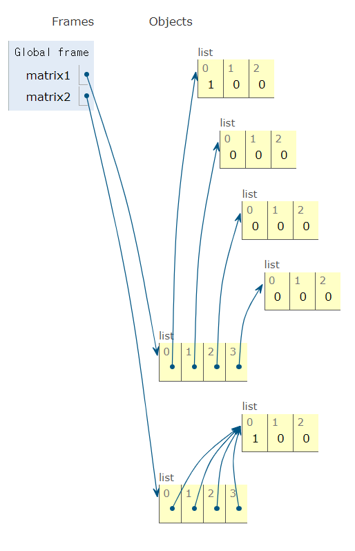

# 2차원

## 2차원 리스트의 개념

```python
	   #   0  1  2    0  1  2    0  1  2
matrix = [[1, 2, 3], [4, 5, 6], [7, 8, 9]]
       #      0          1          2
'''    
matrix = [
	[1, 2, 3],
	[4, 5, 6],
	[7, 8, 9]
]
'''
print(matrix[0])
>>> [1, 2, 3]
print(matrix[1])
>>> [4, 5, 6]
print(matrix[2])
>>> [7, 8, 9]
print(matrix[0][0])
>>> 1
print(matrix[1][2])
>>> 6
print(matrix[2][0])
>>> 7
```

- 단순히 리스트를 원소로 가지는 리스트이자 행렬

## 2차원 리스트 만들기

- 크기가 작으면 직접 작성해도 상관없음

- 반복문 사용 

  ```python
  n = 4 # 행
  m = 3 # 열
  matrix = []
  
  for _ in range(n):
  	matrix.append([0] * m)
  
  print(matrix)
  >>> [[0, 0, 0], [0, 0, 0], [0, 0, 0], [0, 0, 0]] # n x m 행렬
  ```

- 리스트 Comprehension 사용

  ```python
  n = 4 # 행
  m = 3 # 열
  
  matrix = [[0] * m for _ in range(n)]
  
  print(matrix)
  >>> [[0, 0, 0], [0, 0, 0], [0, 0, 0], [0, 0, 0]]
  ```

  - [주의] 리스트 Comprehension vs 리스트 곱셈 연산

    ```python
    n = 4 # 행
    m = 3 # 열
    matrix1 = [[0] * m for _ in range(n)]
    matrix2 = [[0] * m] * n
    
    matrix1[0][0] = 1
    matrix2[0][0] = 1
    
    print(matrix1)
    >>> [[1, 0, 0], [0, 0, 0], [0, 0, 0], [0, 0, 0]]
    print(matrix2)
    >>> [[1, 0, 0], [1, 0, 0], [1, 0, 0], [1, 0, 0]]
    ```

    

## 입력 받기

### 크기가 미리 주어지는 경우

```python
matrix = []

# 반복문 사용
for _ in range(8):
	line = list(input())
	matrix.append(line)

# 컴프리헨션 사용
matrix = [list(input()) for _ in range(8)]

"""
matrix = [
	['.', 'F', '.', 'F', '.', '.', '.', 'F'], 
	['F', '.', '.', '.', 'F', '.', 'F', '.'], 
	['.', '.', '.', 'F', '.', 'F', '.', 'F'], 
	['F', '.', 'F', '.', '.', '.', 'F', '.'], 
	['.', 'F', '.', '.', '.', 'F', '.', '.'], 
	['F', '.', '.', '.', 'F', '.', 'F', '.'], 
	['.', 'F', '.', 'F', '.', 'F', '.', 'F'], 
	['.', '.', 'F', 'F', '.', '.', 'F', '.']
]
"""
```

```python
"""
3 x 3 크기의 입력을 받아보자.

1 2 3
4 5 6
7 8 9
"""

# 반복문 사용
matrix = []
for _ in range(3):
	line = list(map(int, input().split()))
	matrix.append(line)

# 컴프리헨션 사용
matrix = [list(map(int, input().split())) for _ in range(3)]
```

### 크기가 입력으로 주어지는 경우

```python
n, m = map(int, input().split()) # 8 7
matrix = []

# 반복문 사용
for _ in range(n):
	line = list(map(int, input().split()))
	matrix.append(line)

# 컴프리헨션 사용
matrix = [list(map(int, input().split())) for _ in range(n)]

"""
matrix = [
	[4, 3, 2, 2, 1, 0, 1], 
	[3, 3, 3, 2, 1, 0, 1], 
	[2, 2, 2, 2, 1, 0, 0], 
	[2, 1, 1, 1, 1, 0, 0], 
	[1, 1, 0, 0, 0, 1, 0], 
	[0, 0, 0, 1, 1, 1, 0], 
	[0, 1, 2, 2, 1, 1, 0], 
	[0, 1, 1, 1, 2, 1, 0]
]
"""

```

```python
"""
n x m 크기의 입력을 받아보자.

3 4
1 2 3 4
5 6 7 8
9 0 1 2
"""

# 반복문 사용
n, m = map(int, input().split()) # 3 4
matrix = []
for _ in range(n):
	line = list(map(int, input().split()))
	matrix.append(line)

# 컴프리헨션 사용
n, m = map(int, input().split()) # 3 4
matrix = [list(map(int, input().split())) for _ in range(n)]
```