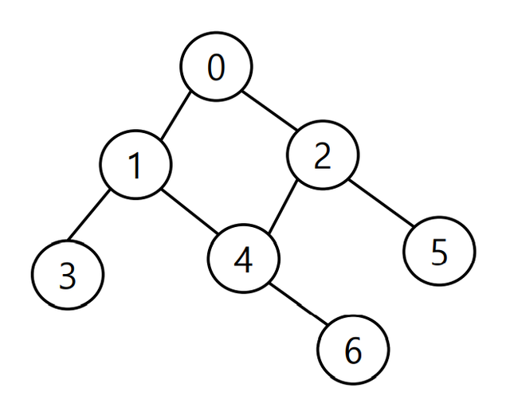
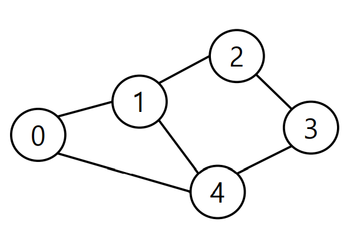
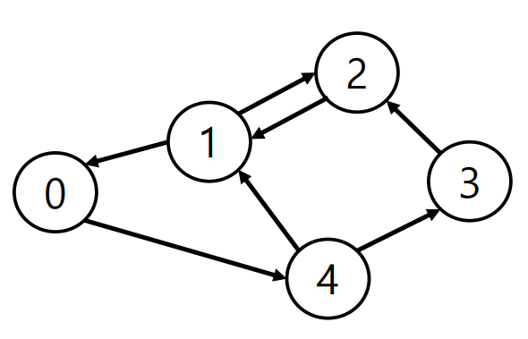

# 그래프

## 그래프의 개념



> 정점(Vertex)과 이를 연결하는 간선(Edge)들의 집합으로 이루어진 비선형 자료구조

- 정점, 노드(Vertex, Node) : 간선으로 연결되는 객체

- 간선(Edge) : 정점 간의 연결 관계를 표현하는 선

- 경로(Path) : 시작 정점부터 도착 정점까지 거치는 정점을 나열한 것

- 인접(Adjacency) : 두 개의 정점이 하나의 간선으로 직접 연결된 상태


## 그래프의 종류

### 무방향 그래프 (Undirected graph)



- 간선의 방향이 없는 가장 일반적인 그래프

- 간선을 통해 양방향의 정점 이동 가능

- 차수(Degree) : 하나의 정점에 연결된 간선의 개수

- 모든 정점의 차수의 합 = 간선 수 x 2

### 방향 그래프 (Directed graph)



- 간선의 방향이 **있는** 그래프

- 간선의 방향이 가리키는 정점으로만 이동 가능

- 차수(Degree) : 진입 차수와 진출 차수로 나누어짐

  - 진입 차수(In-degree) : 외부 정점에서 한 정점으로 들어오는 간선의 수

  - 진출 차수(Out-degree) : 한 정점에서 외부 정점으로 나가는 간선의 수

## 그래프의 표현

> 첫째 줄에 정점의 개수 N(1 ≤ N ≤ 1,000), 간선의 개수 M(1 ≤ M ≤ 10,000), 탐색을 시작할 정점의 번호 V가 주어진다.
>
> 다음 M개의 줄에는 간선이 연결하는 두 정점의 번호가 주어진다.
>
> 어떤 두 정점 사이에 여러 개의 간선이 있을 수 있다.
>
> 입력으로 주어지는 간선은 양뱡향이다.
>
> 첫째 줄에 DFS를 수행한 결과를, 그 다음 줄에는 BFS를 수행한 결과를 출력한다.  
>
> V부터 방문된 점을 순서대로 출력하면 된다.

| 입력                                                      | 출력                    |
| --------------------------------------------------------- | ----------------------- |
| `4 5 1`<br/>`1 2`<br/>`1 3`<br/>`1 4`<br/>`2 4`<br/>`3 4` | `1 2 4 3`<br/>`1 2 3 4` |

- 문제에서는 그래프를 위와 같이 간선이 연결하는 두 정점의 목록으로 제공

### 인접 행렬

- 두 정점을 연결하는 간선이 없으면 0, 있으면 1을 가지는 행렬로 표현하는 방식


|       | **0** | **1** | **2** | **3** | **4** | **5** | **6** |
| :---: | :---: | :---: | :---: | :---: | :---: | :---: | :---: |
| **0** |   0   |   1   |   1   |   0   |   0   |   0   |   0   |
| **1** |   1   |   0   |   0   |   1   |   1   |   0   |   0   |
| **2** |   1   |   0   |   0   |   0   |   1   |   1   |   0   |
| **3** |   0   |   1   |   0   |   0   |   0   |   0   |   0   |
| **4** |   0   |   1   |   1   |   0   |   0   |   0   |   1   |
| **5** |   0   |   0   |   1   |   0   |   0   |   0   |   0   |
| **6** |   0   |   0   |   0   |   0   |   1   |   0   |   0   |

```python
# 인접 행렬 만들기

n = 7 # 정점 개수
m = 7 # 간선 개수

graph = [[0] * n for _ in range(n)]

for _ in range(m):
    v1, v2 = map(int, input().split())
    graph[v1][v2] = 1
    graph[v2][v1] = 1

# 입력
0 1
0 2
1 3
1 4
2 4
2 5
4 6

# 인접 행렬 결과
graph = [
    [0, 1, 1, 0, 0, 0, 0],
    [1, 0, 0, 1, 1, 0, 0],
    [1, 0, 0, 0, 1, 1, 0],
    [0, 1, 0, 0, 0, 0, 0],
    [0, 1, 1, 0, 0, 0, 1],
    [0, 0, 1, 0, 0, 0, 0],
    [0, 0, 0, 0, 1, 0, 0]
]
```

- 인접 행렬은 직관적이고 만들기 편하지만, 불필요하게 공간이 낭비됨


### 인접 리스트

- 리스트를 통해 각 정점에 대한 인접 정점들을 순차적으로 표현하는 방식


| **0** |  1   |  2   |      |
| :---: | :--: | :--: | :--: |
| **1** |  0   |  3   |  4   |
| **2** |  0   |  4   |  5   |
| **3** |  1   |      |      |
| **4** |  1   |  2   |  6   |
| **5** |  2   |      |      |
| **6** |  4   |      |      |

```python
# 인접 리스트 만들기

n = 7 # 정점 개수
m = 7 # 간선 개수

graph = [[] for _ in range(n)]

for _ in range(m):
    v1, v2 = map(int, input().split())
    graph[v1].append(v2)
    graph[v2].append(v1)

# 입력
0 1
0 2
1 3
1 4
2 4
2 5
4 6

# 인접 리스트 결과
graph = [
    [1, 2],
    [0, 3, 4],
    [0, 4, 5],
    [1],
    [1, 2, 6],
    [2],
    [4]
]
```

- 인접 리스트는 연결된 정점만 저장하여 효율적이므로 자주 사용됨
