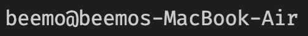
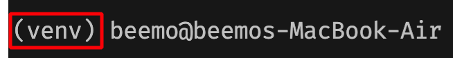

# [KDT] DB - ORM(Object Relational Mapping) 실습

## 목표
* ORM 이해
* Django Model 이해
* Django Queryset 이해
* 테이블 간 관계에 대한 이해와 Django에서의 관계 표현 방법

## 실습 환경 설정
| 아래 명령어는 모두 터미널에서 수행해주세요.
### 가상환경

* 생성
```bash
python -m venv venv
```

* 실행
    * windows
    ```bash
    . venv/Scripts/activate
    ```
    * mac
    ```zsh
    . venv/bin/activate
    ```

* 확인
    * 실행 전
    

    * 실행 후, `경로 위 혹은 왼쪽에 가상환경 이름 출력`
    

* 종료
```bash
deactivate
```
    
### 패키지 설치
| 아래의 모든 명령어는 가상환경을 실행한 상태로 진행하세요. 
* 가상환경 실행
   * windows
    ```bash
    . venv/Scripts/activate
    ```
    * mac
    ```zsh
    . venv/bin/activate
    ```
* pip install
```bash
pip install -r requirements.txt 
```

* django 패키지 설치 확인
```bash
python manage.py --version
# 4.0.6
```

### 모델 마이그레이션
```bash
python manage.py makemigrations

python manage.py migrate
```

### django shell
* shell 진입
```bash
python manage.py shell_plus
```

* 진입 확인


### 파일 실행
| 파일을 실행할 때에는 가상환경을 실행한 상태인지 꼭 확인합니다.
```bash
python main.py
```


## License
The MIT License (MIT) Copyright (c) 2022 Dan Caron

Permission is hereby granted, free of charge, to any person obtaining a copy of this software and associated documentation files (the "Software"), to deal in the Software without restriction, including without limitation the rights to use, copy, modify, merge, publish, distribute, sublicense, and/or sell copies of the Software, and to permit persons to whom the Software is furnished to do so, subject to the following conditions:

The above copyright notice and this permission notice shall be included in all copies or substantial portions of the Software.

THE SOFTWARE IS PROVIDED "AS IS", WITHOUT WARRANTY OF ANY KIND, EXPRESS OR IMPLIED, INCLUDING BUT NOT LIMITED TO THE WARRANTIES OF MERCHANTABILITY, FITNESS FOR A PARTICULAR PURPOSE AND NONINFRINGEMENT. IN NO EVENT SHALL THE AUTHORS OR COPYRIGHT HOLDERS BE LIABLE FOR ANY CLAIM, DAMAGES OR OTHER LIABILITY, WHETHER IN AN ACTION OF CONTRACT, TORT OR OTHERWISE, ARISING FROM, OUT OF OR IN CONNECTION WITH THE SOFTWARE OR THE USE OR OTHER DEALINGS IN THE SOFTWARE.
