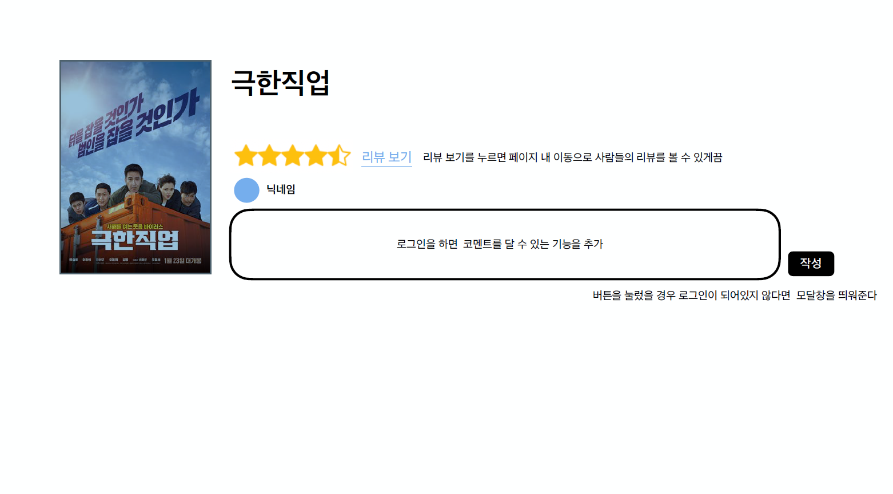
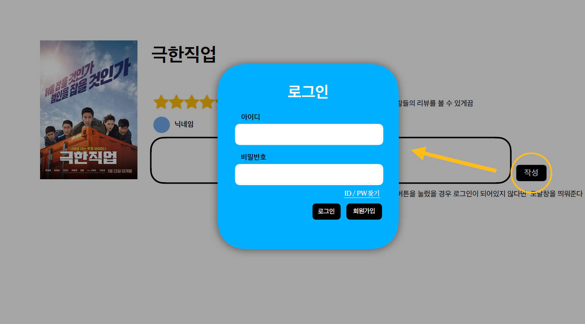
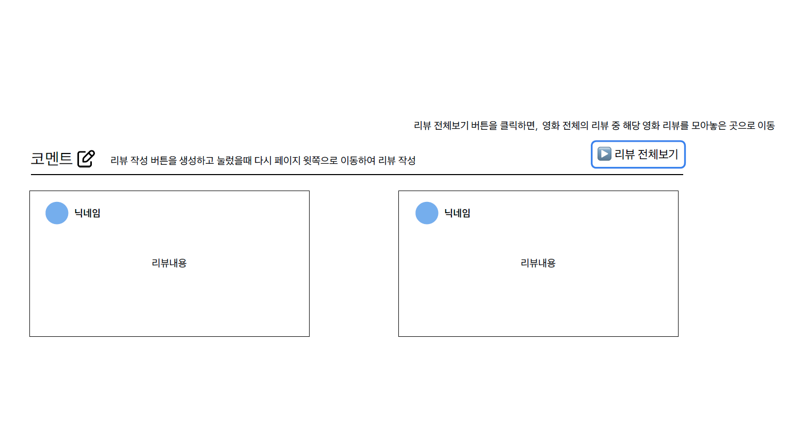
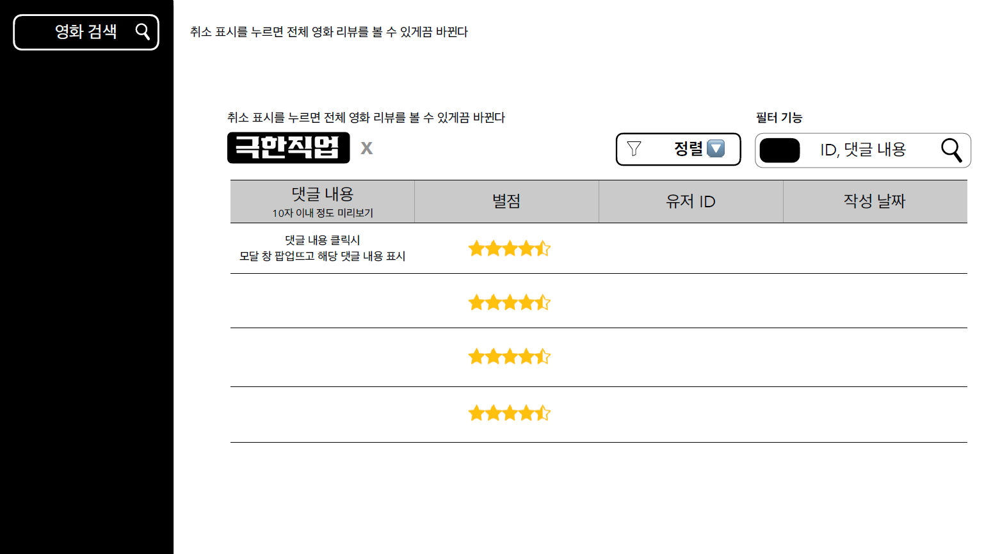
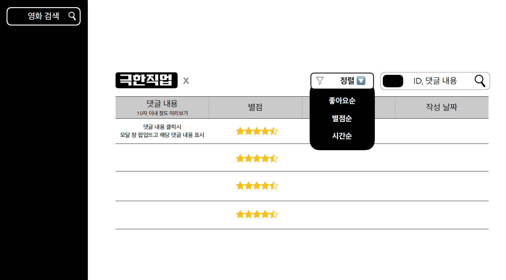
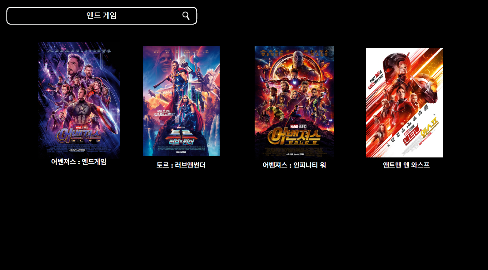
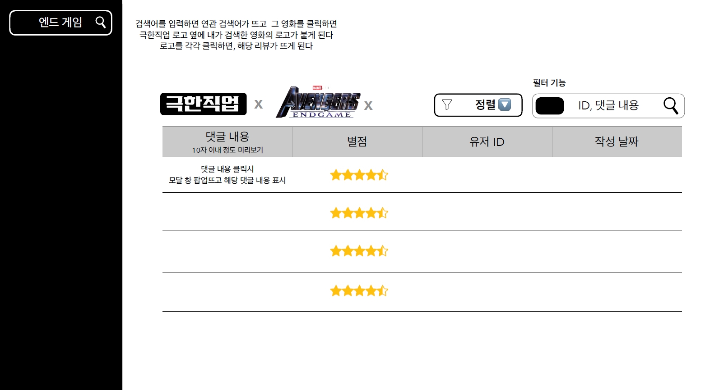

# 특강 및 프로젝트 사전 기획

Date: 2022년 9월 23일

```
⏰ 오늘의 일정
오전 : 특강 및 실습 풀이
오후 : 프로젝트 사전 조사 및 학습 정리
13 : 30 ~ 14 : 40 - 프로젝트 사전 조사
14 : 40 ~ 15 : 00 - 휴식
15 : 00 ~ 17 : 30 - 개인 학습
17 : 30 ~ 17 : 50 - 휴식
~ 18 : 00 - 마무리
```

---

# 조사 및 기획

```
📚 5주 동안 진행할 금요일 영화 리뷰 커뮤니티 개발 프로젝트를 위한 사전 조사 시간입니다.
1시간 동안 페어와 함께 아래 내용을 수행합니다.
```

## 기능 조사 및 설계

영화 리뷰 커뮤니티 서비스에 필요한 기능들을 조사하고, 논의하고, 정리합니다.

정리 양식은 자유입니다. 아래는 화면을 기준으로 기능을 정리한 예시입니다.

오늘 모든 것을 기획할 필요는 없습니다. 5주 동안 개발 뿐만 아니라 기획도 완성시켜 나가는 게 목표입니다. 

- 예시
  
    ### 리뷰 목록 페이지
    
    1. 리뷰 목록 출력
    2. 리뷰 작성 버튼
    3. 리뷰 보기 버튼
    4. …
    
    ### 글 작성 페이지
    
    1. 리뷰 작성 폼
        1. 영화 제목
        2. 리뷰 내용
        3. 평점
        4. …
    2. 리뷰 작성 완료 버튼

## 화면 조사 및 설계

위에서 정리한 기능을 표현할 화면을 조사하고, 논의하고, 정리합니다.

구현해보고 싶은 사이트의 화면을 스크린샷으로 저장해두거나

그림판으로 간단하게 레이아웃을 그려보거나

피그마를 사용할 수 있다면 디테일하게 요소들을 배치해보거나

자유롭게 화면을 기획해주세요.













