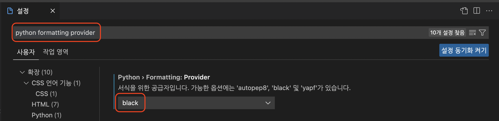
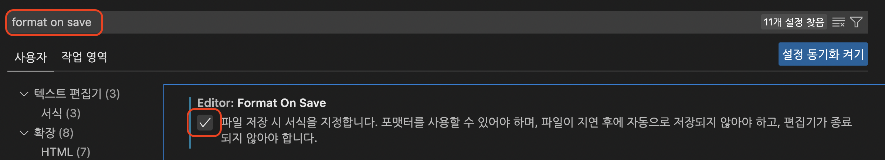
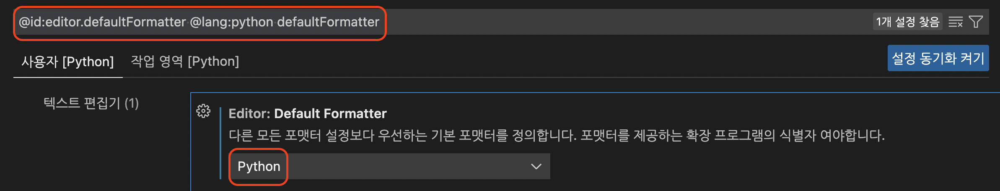
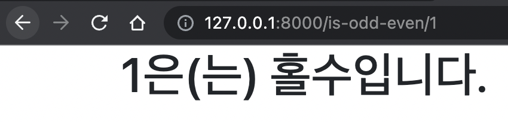
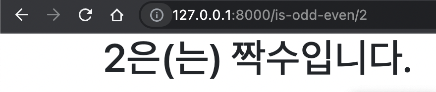
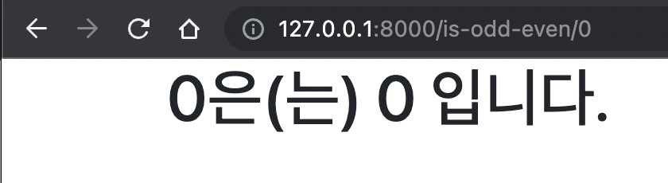
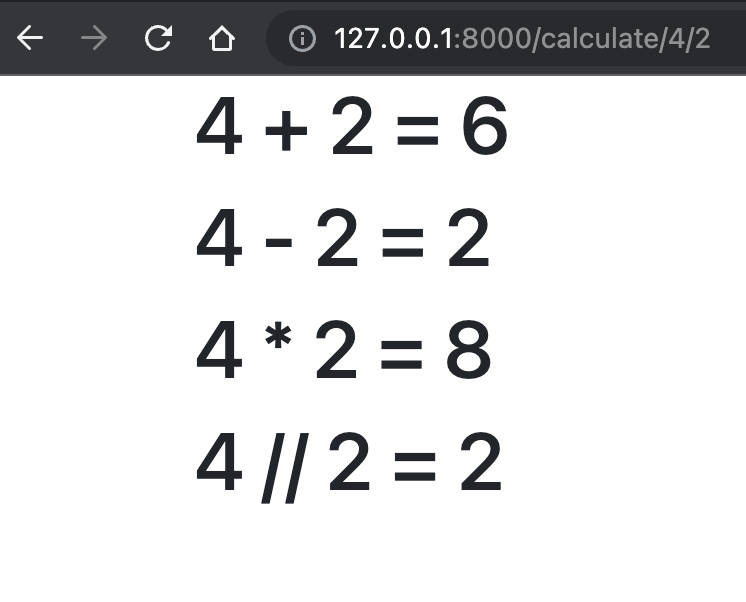
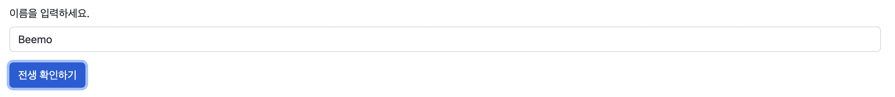
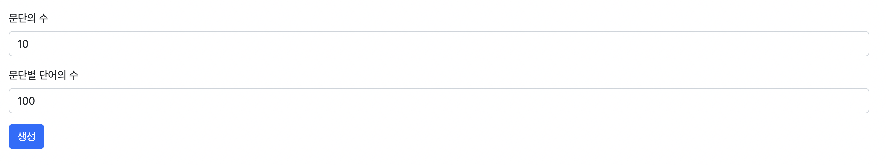
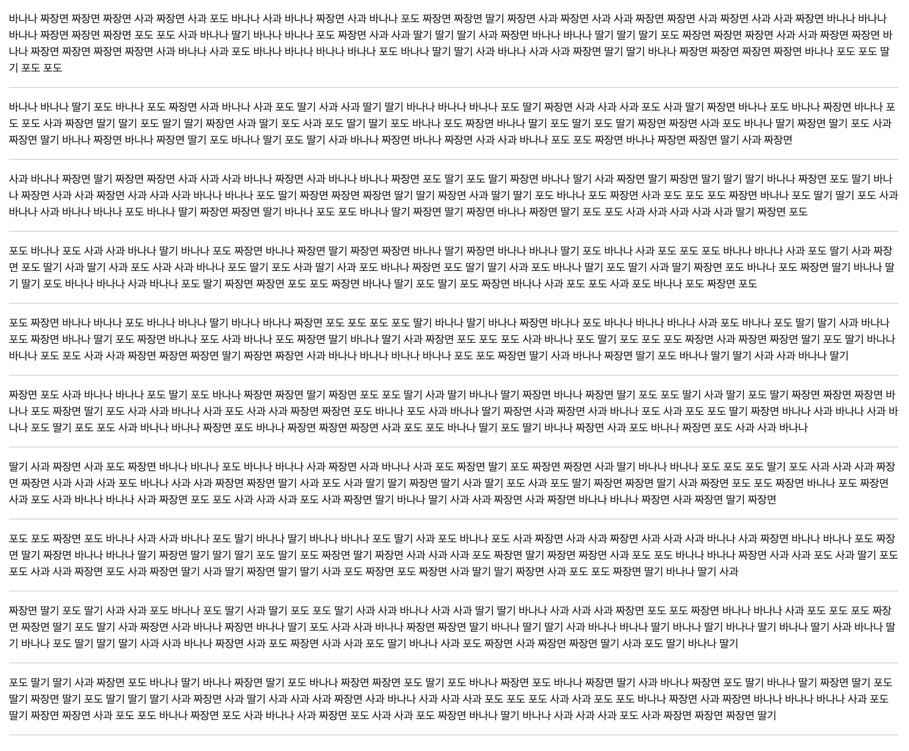

# 장고 03

Date: 2022년 9월 26일

```
⏰ 오늘의 일정

~ 13 : 30 - 점심 시간
~ 14 : 30 - 오전 실습 복습
~ 14 : 40 - 쉬는 시간
~ 16 : 30 - 실습 시간
~ 16 : 50 - 쉬는 시간
~ 17 : 50 - 실습 시간
~ 18 : 00 - 마무리

```

---

# 실라버스 접속 오류 해결 완료.

# 복습

[자료 공유](https://www.notion.so/e7ee7159a74243d8bf865f89f78e2c85) 

# 실습

```
📚 아래 실습 진행 진행 후 **가상환경 폴더를 제외한** 파일 폴더를 압축해서 실라버스에 제출해주세요.
가상환경을 포함해서 제출하면 용량 제한을 초과하니 꼭 가상환경 폴더를 제외하고 압축해서 제출해주세요.

DJANGO 개발은 꼭 가상 환경을 실행한 상태로 진행 하자!

```

## Code Formatter black 설정

```
🧑‍💻 Code Formatter는 1인 개발에서는 코드 스타일에 대한 고민을 줄여주고, 2명 이상의 프로젝트에서 코드 스타일을 통일하기 위해 사용합니다.

```

- 설정 가이드 열기
    - 참고 사이트
      
        [Python Code Formatter Black 적용기](https://jiku90.tistory.com/12)
        
        [vscode에서 black으로 code format 자동화하기 (python)](https://lovedh.tistory.com/entry/vscode%EC%97%90%EC%84%9C-black%EC%9C%BC%EB%A1%9C-code-format-%EC%9E%90%EB%8F%99%ED%99%94%ED%95%98%EA%B8%B0-python)
        
    1. black 패키지 설치(가상환경 마다)
       
        ```bash
        pip install black
        ```
        
    2. vscode python formatting provider 설정
       
        
        
    3. vscode format on save 체크
       
        
        
    4. 파이썬 코드 수정 후 저장하기
    5. (위 설정으로 적용이 안되면) vscode **@id:editor.defaultFormatter @lang:python defaultFormatter 설정**
       
        
        

## 오전 수업 실습

오전 수업 내용을 함께 실습 하겠습니다. 

- 개발 환경 설정
  
    ```bash
    # 가상환경 생성
    python -m venv [가상환경이름]
    
    # 가상환경 실행
    # ls 명령어 입력 후 현재 경로에서 가상환경 폴더 확인
    # 윈도우
    . [가상환경이름]/Scripts/actiave
    
    # 맥
    . [가상환경이름]/bin/activate
    
    # django LTS 버전 설치
    pip install django==3.2.13
    
    # 앱 생성
    # ls 명령어 입력 후 현재 경로에서 manage.py 파일 확인
    python manage.py startapp [앱이름]
    
    # 앱 등록
    # 프로젝트설정폴더/settings.py - INSTALLED_APPS 리스트에 생성한 앱 추가
    
    # 서버 실행 테스트
    python manage.py runserver
    ```
    

## [url] 입력한 숫자가 홀수인지 짝수인지 확인하기

숫자를 입력하면 숫자가 홀수인지 짝수인지 0인지 판단하고 화면에 표시하는 프로그램을 개발하세요.

해당 프로그램은 Path parameter를 활용해야 합니다.

- 주소창에 직접 값을 넣는 형태로 실습을 진행합니다.(form 사용 x)
    - EX) is-odd-even/1 , is-odd-even/2 , is-odd-even/0

### 화면 예시







## [url] 사칙연산 수행하기

숫자 2개를 입력하면 사칙연산 수행 결과를 화면에 표시하는 프로그램을 개발하세요.

해당 프로그램은 Path parameter를 활용해야 합니다.

- 주소창에 직접 값을 넣는 형태로 실습을 진행합니다.(form 사용 x)
- 사칙연산은 view에서 수행합니다. view에서 연산한 결과를 템플릿에 출력합니다.

### 화면 예시



## [form] 랜덤 전생

이름을 입력하면 랜덤으로 대상의 전생을 화면에 표시하는 프로그램을 개발하세요. 

또는 아래 사이트를 참고해서 랜덤 게임을 개발하세요.

[봉봉 - 심심할 땐 봉봉!](https://kr.vonvon.me/)

해당 프로그램은 form 태그를 활용하여 사용자에게 텍스트 1개를 입력 받아야 합니다.

- 페이지 2개를 만듭니다.
    - 이름을 입력하는 폼이 있는 페이지
    - 랜덤으로 전생을 출력하는 페이지

### 화면 예시

- 이름 입력 페이지
  
    
    
- 전생 확인 페이지
  
    
    

## [form] 로렘 입숨 한글 버전

[https://www.lipsum.com/](https://www.lipsum.com/) 의 한글 버전 프로그램을 개발하세요.

해당 프로그램은 form 태그를 활용하여 사용자에게 숫자 2개를 입력 받아야 합니다.

- 문단의 수
- 문단 별 단어의 수
    - 사용할 단어 꾸러미는 자유롭게 만들어주세요.

생성 버튼을 누르면 랜덤 한글 텍스트를 생성하고 텍스트를 화면에 표시합니다.

### 화면 예시

- 문단 수, 단어 수 입력 페이지
  
    
    
- 텍스트 확인 페이지
  
    