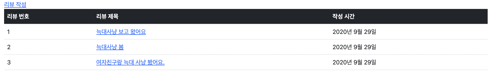
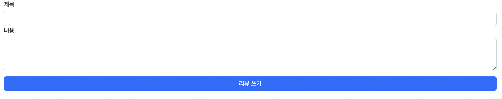
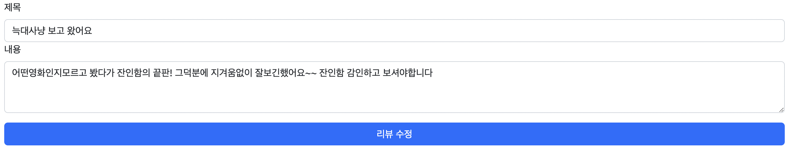

# 페어 프로그래밍1

Date: 2022년 9월 30일

---

## 오늘의 일정

```
⏰ 9 : 00 ~ 11 : 30 페어 프로그래밍
11 : 30 ~ 13 : 00 점심시간
13 : 00 ~ 15 : 00 페어
15 : 00 ~ 15 : 30 쉬는 시간
15 : 30 ~ 17 : 30 페어
17 : 30 ~ 18 : 00 2번 사람 깃 저장소 생성 & 복사(mirror) / 마무리
```

## Github 저장소 Mirror

### 1. 깃허브 새로운 저장소 생성

2번 개발자는 새로운 저장소를 생성합니다.

### 2. 1번 개발자 저장소 clone —mirror

2번 개발자는 1번 개발자의 저장소를 clone —mirror 합니다

```bash
git clone —mirror {1번 개발자 페어 프로그래밍 저장소 주소}
```

### 3. 복사한 저장소의 원격 저장소 설정

2번 개발자는 새롭게 생성한 원격 저장소를 복사해온 프로젝트의 원격 저장소로 설정합니다.

```bash
git remote set-url --push origin {2번 개발자의 새롭게 생성한 저장소 주소}
```

### 4. push

2번 개발자는 프로젝트를 Push 합니다.

```bash
git push --mirror
```

## 페어프로그래밍 흐름

```
개발환경설정
1번.
1. 깃허브 저장소와 장고 프로젝트를 생성
- 2번 사람을 콜라보레이터로 초대

2. 생성한 저장소에 장고 프로젝트를 push
- .gitignore : 가상환경을 ignore
- pip freeze > requirements.txt : 패키지 목록을 생성

2번.
3. 2번 사람이 clone
4. 2번사람만 가상환경 생성과 requirements.txt 설치
- pip install -r requirements.txt 

5. 2번사람만 앱을 생성
6. add / commit / push
7. 1번 pull
- git pull
--------------------------------

개발 진행
# 드라이버 <-> 네비게이터 전환할 때
드라이버 : add commit push
네비게이터 : pull

항상 두 사람이 같은 코드를 유지해야한다.
```

# 주간 페어 프로그래밍 1 - 영화 리뷰 커뮤니티 CRUD

```
📚 페어프로그래밍 진행 후 가상환경 폴더를 제외한 파일 및 폴더를 압축해서 실라버스에 제출해주세요.
가상환경을 포함해서 제출하면 용량 제한을 초과하니 꼭 가상환경 폴더를 제외하고 압축해서 제출해주세요.
```

## 목표

두 사람이 팀을 이뤄서 영화 리뷰 커뮤니티 서비스의 CRUD 기능과 페이지를 구현합니다.

## 요구 사항

### 모델 Model

모델은 아래 조건을 만족해야합니다. 

기능 추가를 위한 필드를 추가해도 됩니다.

- 모델 이름 : Review
- 모델 필드
  
  
    | 이름 | 역할 | 필드 | 속성 |
    | --- | --- | --- | --- |
    | title | 리뷰 제목 | Char | max_length=80 |
    | content | 리뷰 내용 | Text |  |
    | created_at | 할 일 생성시간 | DateTime | auto_now_add=True |
    | updated_at | 할 일 수정시간 | DateTime | auto_now = True |
    |  |  |  |  |

### 기능 View

아래 작성된 기능을 구현합니다.

- 리뷰 목록 보기
- 리뷰 내용 보기
- 리뷰 작성 하기
- 리뷰 수정하기
- 리뷰 삭제하기

### 화면 Template

아래 작성된 페이지와 컴포넌트를 구현해야 합니다.

- 리뷰 목록 페이지 index
    - 리뷰 ID / 리뷰 제목 / 리뷰 작성 시간
        - 리뷰 제목 클릭 시 해당 리뷰의 detail 페이지로 이동
    
    - 작성 버튼
      
        
        
        - 버튼 클릭 시 new 페이지로 이동

- 리뷰 보기 페이지 detail
    - 리뷰 제목 / 리뷰 내용 / 리뷰 작성 시간
    - 수정 버튼
        - 버튼 클릭 시 edit 페이지로 이동
    - 삭제 버튼
        - 버튼 클릭 시 리뷰 삭제 delete
    
    
    
- 리뷰 작성 페이지 new
    - 리뷰 제목 / 리뷰 내용
    - 생성 버튼
        - 버튼 클릭 시 새로운 리뷰 생성 create
    
    
    
- 리뷰 수정 페이지 edit
    - 작성 폼에 원본 리뷰의 제목 과 내용이 작성된 상태.
    - 수정 버튼
        - 버튼 클릭 시 해당 리뷰 데이터 수정 update
    
    