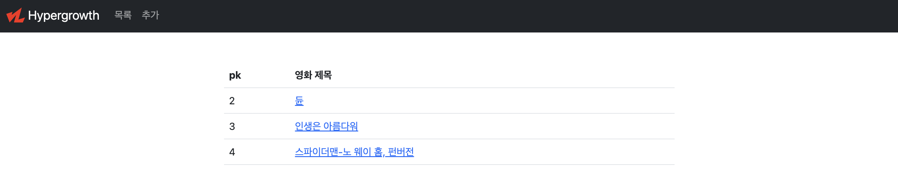
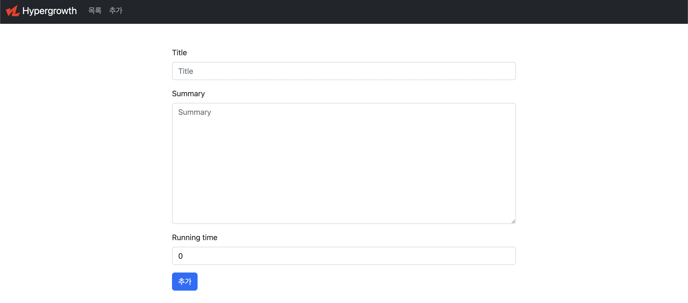
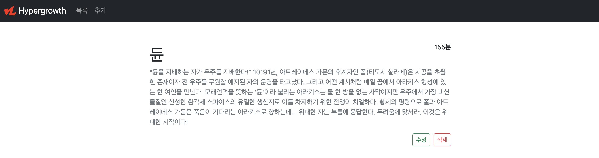

# 장고 09

Date: 2022년 10월 6일

```
⏰ 오늘의 일정   
~ 13 : 00 - 점심 시간
~ 15 : 00 - 실습 시간
~ 15 : 30 - 쉬는 시간
~ 17 : 30 - 실습 시간
~ 17 : 50 - 쉬는 시간
~ 18 : 00 - 마무리
```

---

## vscode Django Template 자동 정렬

https://velog.io/@junsikchoi/VSCode%EC%97%90%EC%84%9C-Django-%ED%85%9C%ED%94%8C%EB%A6%BF-%EC%98%A4%ED%86%A0-%ED%8F%AC%EB%A7%A4%ED%8C%85%ED%95%98%EA%B8%B0

# 실습

>📚 실습 진행 진행 후 **가상환경 폴더를 제외한** 파일 폴더를 압축해서 실라버스에 제출해주세요.
>가상환경을 포함해서 제출하면 용량 제한을 초과하니 꼭 가상환경 폴더를 제외하고 압축해서 제출해주세요. 
>
> DJANGO 개발은 꼭 가상 환경을 실행한 상태로 진행하세요.


## 목표

ModelForm / Staticfiles를 활용한 영화 정보 제공 서비스를 개발합니다.

## 요구사항

### 모델 Model

모델은 아래 조건을 만족해야하며 적절한 필드와 속성을 설정하세요.

- 모델 이름 : Movie
- 모델 필드
  
  
    | 필드 이름 | 역할 | 필드 | 속성 |
    | --- | --- | --- | --- |
    | title | 영화 제목 |  |  |
    | summary | 줄거리 |  |  |
    | running_time | 영화 상영 시간 |  |  |

### 기능 View

아래 작성된 기능을 구현합니다.

생성 및 수정은 ModelForm을 사용하여 구현합니다.

- 영화 데이터 목록 조회
    - `GET` `http://127.0.0.1:8000/movies/`
- 영화 데이터 정보 조회
    - `GET` `http://127.0.0.1:8000/movies/<int:pk>/`
- 영화 데이터 생성
    - `POST` `http://127.0.0.1:8000/movies/create/`
- 영화 데이터 수정
    - `POST` `http://127.0.0.1:8000/movies/<int:pk>/update/`
- 영화 데이터 삭제
    - `POST` `http://127.0.0.1:8000/movies/<int:pk>/delete/`

### 화면 Template

아래 작성된 페이지를 구현합니다.

1. **네비게이션바, Bootstrap Navbar 컴포넌트**
    - 서비스 로고
        - Django Staticfiles 활용
    - 목록 버튼
        - 클릭 시 메인 페이지로 이동
    - 추가 버튼
        - 클릭 시 정보 추가 페이지로 이동
2. **메인 페이지**
    - `GET` `http://127.0.0.1:8000/movies/`
    - 영화 목록 출력
    - 제목을 클릭하면 해당 영화의 정보 페이지로 이동
3. **영화 정보 페이지**
    - `GET` `http://127.0.0.1:8000/movies/<int:pk>/`
    - 해당 영화 정보 출력
    - 수정 / 삭제 버튼
4. **영화 작성 페이지**
    - `GET` `http://127.0.0.1:8000/movies/create/`
    - 영화 정보 작성 폼
5. **영화 수정 페이지**
    - `GET` `http://127.0.0.1:8000/movies/<int:pk>/update/`
    - 영화 정보 수정 폼
- 참고 화면





