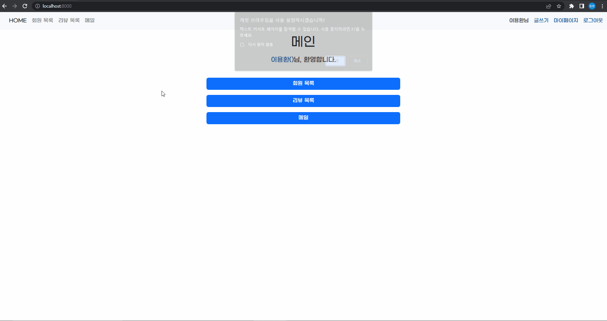
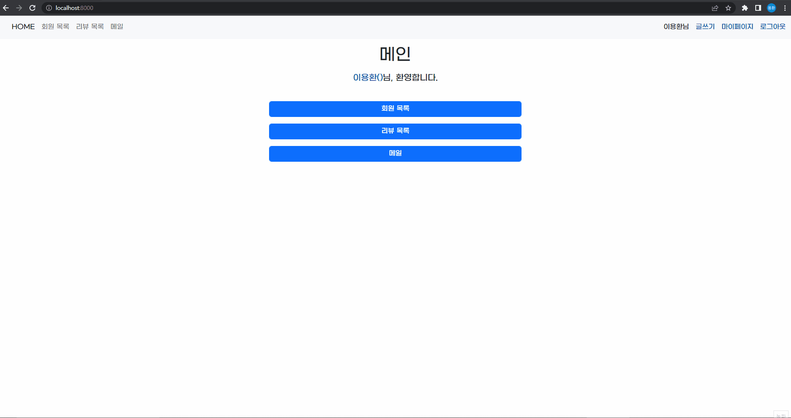
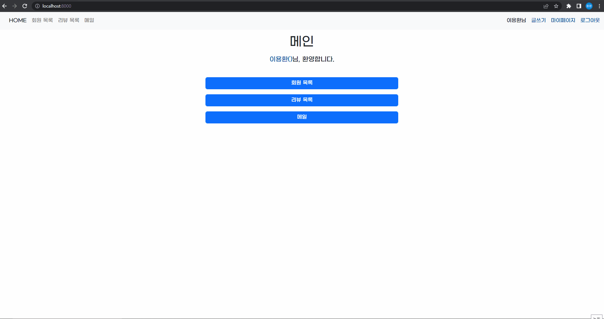

# 페어 프로그래밍 3

- 영화 리뷰 커뮤니티 만들기

## 프로젝트 기간

- 2022-10-14

## 사용 기술

- Python, Django, HTML, CSS, Bootstrap5

## 프로젝트 목적

페어 프로그래밍을 통한 영화 리뷰 커뮤니티 서비스 개발

- **CRUD** 구현
- **Staticfiles** 활용 정적 파일(이미지, CSS, JS) 다루기
- Django **Auth** 활용 회원 관리(회원가입 / 회원 조회 / 로그인 / 로그아웃)

## 프로젝트 역할

- 이용환 - 이메일 보내기 기능
- 조성윤 - 게시판 CRUD
- 김수빈 - 회원가입 / 회원 조회 / 로그인 / 로그아웃

## 프로젝트 느낀 점

- 지금까지 배운 걸 모두 동원하느라 힘들었지만 그래도 제법 멋진 결과물이 나온 것 같아 뿌듯하다.
