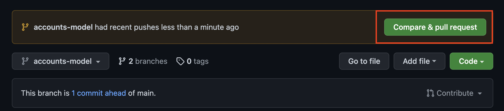

# 페어

Date: 2022년 10월 14일

---

## 페어프로그래밍 가이드

개발 환경 설정을 제외한 모든 토픽 개발은 아래 순서에 따라 진행합니다.

1. [로컬/드라이버] main 브랜치에서 개발 토픽에 해당하는 브랜치 생성 및 브랜치 전환
   
    ```bash
    # 브랜치 생성 & 전환
    git checkout -b [토픽 브랜치명]
    
    # git checkout [브랜치명] : 브랜치를 전환합니다.
    # git checkout -b [브랜치명] : 브랜치를 생성하고 전환합니다. 동일한 브랜치가 있으면 오류가 발생합니다.
    ```
    
2. [로컬/드라이버] 토픽 개발
3. [로컬/드라이버] 토픽 개발 후 동일한 이름의 원격 저장소 브랜치에 Commit&Push
   
    ```bash
    git add .
    
    git commit -m '커밋 메세지'
    
    git push origin [토픽 브랜치명]
    ```
    
4. [원격/드라이버] 토픽 브랜치 병합
   
    1. 깃허브 PR 생성(토픽 브랜치 → main 브랜치)
       
        
        
    2. 브랜치 병합(토픽 브랜치 → main 브랜치)
       
        
        
        
        
    3. 토픽 브랜치 삭제
       
        
    
5. [로컬/전체] main 브랜치 전환 후 Pull
   
    ```bash
    # main 브랜치로 전환
    git checkout main
    
    # main 브랜치 Pull
    git pull origin main
    ```
    
6. [로컬/드라이버] 토픽 브랜치 삭제
   
    ```bash
    # 토픽 브랜치 삭제
    git branch -d [토픽 브랜치명]
    ```
    
7. 드라이버 변경 후 1번 부터 시작

## 깃 브랜치 명령어

```bash
# 브랜치 생성 & 전환
git checkout -b [브랜치명]

# 브랜치 전환
git checkout [브랜치명]

# 브랜치 삭제
git branch -d [브랜치명]

# 브랜치 이름 변경
git branch -m [기존 브랜치명] [변경할 브랜치명]
```

## 목표

페어 프로그래밍을 통한 영화 리뷰 커뮤니티 서비스를 개발합니다. 아래 조건을 만족해야합니다.

- **CRUD** 구현
- **Staticfiles** 활용 정적 파일(이미지, CSS, JS) 다루기
- Django **Auth** 활용 회원 관리(회원가입 / 회원 조회 / 로그인 / 로그아웃)

## 토픽

### 1. 깃 설정

branch main

- 원격 저장소 생성
- 콜라보레이터 초대
- 로컬 저장소 깃 초기화
  
    ```bash
    git init
    ```
    
- 로컬 저장소 .gitignore 생성
  
    ```bash
    touch .gitigngit ore
    ```
    
- .gitignore 작성
    - 아래 사이트 입력창에 필요한 언어 & 프레임워크 & 환경 입력 후 생성
    
    [gitignore.io](https://www.toptal.com/developers/gitignore/)
    

```
❗ 위 과정 완료 후 
[로컬/드라이버] main → [원격/드라이버] main, Commit & Push 수행
[원격/전체] 저장소 Clone 수행
드라이버 변경
[로컬/새 드라이버] setup-django 브랜치에서 다음 토픽 진행
```

---

### 2. 장고 개발환경 설정

branch setup-django 

Django 프로젝트 생성

- 가상환경 생성 & 실행
- 필요한 패키지 설치 git
  
    주의
    
    
    
- 패키지 목록 저장
  
    ```bash
    pip freeze > requirements.txt
    ```
    
- Django 프로젝트 생성
  
    ```bash
    django-admin startproject config .
    ```
    

```
❗ 위 과정 완료 후 
[로컬/드라이버] setup-django → [원격/드라이버] setup-django,  Commit & Push 수행
[원격/드라이버] setup-django → [원격/드라이버] main, PR 생성 & Merge 수행
[원격/드라이버] setup-django 브랜치 삭제
[원격/전체] main → [로컬/전체] main, Pull 수행
[로컬/드라이버] setup-django 브랜치 삭제
드라이버 변경
[로컬/새 드라이버] accounts/signup 브랜치에서 다음 토픽 진행
```

---

### 3. 회원가입

branch accounts/signup

앱 App

앱 이름 : accounts

모델 Model

모델 이름 : User

- Django **AbstractUser** 모델 상속

**폼 Form**

- Django 내장 회원가입 폼 UserCreationForm을 상속 받아서 CustomUserCreationForm 작성
  
    해당 폼은 아래 필드만 출력합니다.
    
    - username
    - password1
    - password2

**기능 View**

회원가입

- `POST` `http://127.0.0.1:8000/accounts/signup/`
- CustomUserCreationForm을 활용해서 회원가입 구현

**화면 Template**

회원가입 페이지

- `GET` `http://127.0.0.1:8000/accounts/signup/`
- 회원가입 폼

 

```
❗ 위 과정 완료 후 
[로컬/드라이버] accounts/signup → [원격/드라이버] accounts/signup,  Commit & Push 수행
[원격/드라이버] accounts/signup → [원격/드라이버] main, PR 생성 & Merge 수행
[원격/드라이버] accounts/signup 브랜치 삭제
[원격/전체] main → [로컬/전체] main, Pull 수행
[로컬/드라이버] accounts/signup 브랜치 삭제
드라이버 변경
[로컬/새 드라이버] accounts/login 브랜치에서 다음 토픽 진행
```

---

### 4. 로그인

branch accounts/login

**폼 Form**

로그인

- Django 내장 로그인 폼 **AuthenticationForm 활용**

**기능 View**

로그인

- `POST` `http://127.0.0.1:8000/accounts/login/`
- **AuthenticationForm**를 활용해서 로그인 구현

**화면 Template**

로그인 페이지

- `GET` `http://127.0.0.1:8000/accounts/login/`
- 로그인 폼
- 회원가입 페이지 이동 버튼

```
❗ 위 과정 완료 후 
[로컬/드라이버] accounts/login → [원격/드라이버] accounts/login,  Commit & Push 수행
[원격/드라이버] accounts/login → [원격/드라이버] main, PR 생성 & Merge 수행
[원격/드라이버] accounts/login 브랜치 삭제
[원격/전체] main → [로컬/전체] main, Pull 수행
[로컬/드라이버] accounts/login 브랜치 삭제
드라이버 변경
[로컬/새 드라이버] accounts/index 브랜치에서 다음 토픽 진행
```

---

### 5. 회원 목록 조회

`branch` accounts/index

**기능 View**

회원 목록 조회

- `GET` `http://127.0.0.1:8000/accounts/`

**화면 Template**

회원 목록 페이지

- `GET` `http://127.0.0.1:8000/accounts/`
- 회원 목록 출력
- 회원 아이디를 클릭하면 해당 회원 조회 페이지로 이동

```
❗ 위 과정 완료 후 
[로컬/드라이버] accounts/index → [원격/드라이버] accounts/index,  Commit & Push 수행
[원격/드라이버] accounts/index → [원격/드라이버] main, PR 생성 & Merge 수행
[원격/드라이버] accounts/index 브랜치 삭제
[원격/전체] main → [로컬/전체] main, Pull 수행
드라이버 변경
[로컬/새 드라이버] accounts/detail 브랜치에서 다음 토픽 진행
```

---

### 6. 회원 정보 조회

`branch` accounts/detail

**기능 View**

회원 정보 조회

- `GET` `http://127.0.0.1:8000/accounts/<int:user_pk>/`

**화면 Template**

회원 조회 페이지(프로필 페이지)

- `GET` `http://127.0.0.1:8000/accounts/<int:user_pk>/`

```
❗ 위 과정 완료 후 
[로컬/드라이버] accounts/detail → [원격/드라이버] accounts/detail,  Commit & Push 수행
[원격/드라이버] accounts/detail → [원격/드라이버] main, PR 생성 & Merge 수행
[원격/드라이버] accounts/detail 브랜치 삭제
[원격/전체] main → [로컬/전체] main, Pull 수행
드라이버 변경
[로컬/새 드라이버] accounts/update 브랜치에서 다음 토픽 진행
```
---

### 7. 회원 정보 수정

branch accounts/update

**폼 Form**

회원 정보 수정

- Django 내장 회원 수정 폼 UserChangeForm을 상속 받아서 **CustomUserChangeForm** 작성
  
    해당 폼은 아래 필드만 출력합니다.
    
    - first_name
    - last_name
    - email

**기능 View**

회원 정보 수정

- `POST` `http://127.0.0.1:8000/accounts/update/`

**화면 Template**

회원 정보 수정 페이지

- `GET` `http://127.0.0.1:8000/accounts/update/`

```
❗ 위 과정 완료 후 
[로컬/드라이버] accounts/update → [원격/드라이버] accounts/update,  Commit & Push 수행
[원격/드라이버] accounts/update → [원격/드라이버] main, PR 생성 & Merge 수행
[원격/드라이버] accounts/update 브랜치 삭제
[원격/전체] main → [로컬/전체] main, Pull 수행
드라이버 변경
[로컬/새 드라이버] accounts/logout 브랜치에서 다음 토픽 진행
```
---

### 8. 로그아웃

branch accounts/logout

**기능 View**

로그아웃

- `POST` `http://127.0.0.1:8000/accounts/logout/`

```
❗ 위 과정 완료 후 
[로컬/드라이버] accounts/logout → [원격/드라이버] accounts/logout,  Commit & Push 수행
[원격/드라이버] accounts/logout → [원격/드라이버] main, PR 생성 & Merge 수행
[원격/드라이버] accounts/logout 브랜치 삭제
[원격/전체] main → [로컬/전체] main, Pull 수행
드라이버 변경
[로컬/새 드라이버] template/navbar 브랜치에서 다음 토픽 진행
```

---

### 9. 네비게이션바

branch template/navbar

**화면 Template**

**네비게이션바**

- 리뷰 목록 페이지 이동 버튼
- 리뷰 작성 페이지 이동 버튼
- 비 로그인 유저는 작성 버튼 출력 X
- 로그인 상태에 따라 다른 화면 출력
    1. 로그인 상태
        - 로그인 한 사용자의 username 출력
            - username을 클릭하면 회원 조회 페이지로 이동
        - 로그아웃 버튼
    2. 비 로그인 상태
        - 로그인 페이지 이동 버튼
        - 회원가입 페이지 이동 버튼

```
❗ 위 과정 완료 후 
[로컬/드라이버] template/navbar → [원격/드라이버] template/navbar,  Commit & Push 수행
[원격/드라이버] template/navbar → [원격/드라이버] main, PR 생성 & Merge 수행
[원격/드라이버] template/navbar  브랜치 삭제
[원격/전체] main → [로컬/전체] main, Pull 수행
드라이버 변경
[로컬/새 드라이버] reviews/create 브랜치에서 다음 토픽 진행
```

---

### 10. 리뷰 생성

branch reviews/create

**앱 App**

앱 이름 : reviews

모델 Model

모델 이름 : Review

- 모델 필드
  
  
    | 이름 | 역할 | 필드 | 속성 |
    | --- | --- | --- | --- |
    | title | 리뷰 제목 |  |  |
    | content | 리뷰 내용 |  |  |
    | movie_name | 영화 이름 |  |  |
    | grade | 영화 평점 |  |  |
    | created_at | 리뷰 생성시간 | DateTime | auto_now_add=True |
    | updated_at | 리뷰 수정시간 | DateTime | auto_now = True |

**기능 View**

데이터 생성

- `POST` `http://127.0.0.1:8000/reviews/create/`

**화면 Template**

**리뷰 작성 페이지**

- `GET` `http://127.0.0.1:8000/reviews/create/`
- 리뷰 작성 폼

```
❗ 위 과정 완료 후 
[로컬/드라이버] reviews/create → [원격/드라이버] reviews/create,  Commit & Push 수행
[원격/드라이버] reviews/create → [원격/드라이버] main, PR 생성 & Merge 수행
[원격/드라이버] reviews/create  브랜치 삭제
[원격/전체] main → [로컬/전체] main, Pull 수행
드라이버 변경
[로컬/새 드라이버] reviews/index 브랜치에서 다음 토픽 진행
```

---

### 11. 리뷰 목록 조회

branch reviews/index

**기능 View**

데이터 목록 조회

- `POST` `http://127.0.0.1:8000/reviews/`

**화면 Template**

리뷰 **목록 페이지** 

- `GET` `http://127.0.0.1:8000/reviews/`
- 리뷰 목록 출력
- 제목을 클릭하면 해당 리뷰의 정보 페이지로 이동

```
❗ 위 과정 완료 후 
[로컬/드라이버] reviews/index → [원격/드라이버] reviews/index,  Commit & Push 수행
[원격/드라이버] reviews/index → [원격/드라이버] main, PR 생성 & Merge 수행
[원격/드라이버] reviews/index  브랜치 삭제
[원격/전체] main → [로컬/전체] main, Pull 수행
드라이버 변경
[로컬/새 드라이버] reviews/detail 브랜치에서 다음 토픽 진행
```

---

### 12. 리뷰 정보 조회

branch reviews/detail

**기능 View**

데이터 정보 조회

- `GET` `http://127.0.0.1:8000/reviews/<int:review_pk>/`

**화면 Template**

**리뷰 정보 페이지**

- `GET` `http://127.0.0.1:8000/reviews/<int:review_pk>/`
- 해당 리뷰 정보 출력
- 수정 / 삭제 버튼

```
❗ 위 과정 완료 후 
[로컬/드라이버] reviews/detail → [원격/드라이버] reviews/detail,  Commit & Push 수행
[원격/드라이버] reviews/detail → [원격/드라이버] main, PR 생성 & Merge 수행
[원격/드라이버] reviews/detail  브랜치 삭제
[원격/전체] main → [로컬/전체] main, Pull 수행
드라이버 변경
[로컬/새 드라이버] reviews/update 브랜치에서 다음 토픽 진행
```

---

### 13. 리뷰 정보 수정

branch reviews/update

**기능 View**

데이터 수정

- `POST` `http://127.0.0.1:8000/reviews/<int:review_pk>/update/`

**화면 Template**

**리뷰 수정 페이지**

- `GET` `http://127.0.0.1:8000/reviews/<int:review_pk>/update/`
- 리뷰 수정 폼

```
❗ 위 과정 완료 후 
[로컬/드라이버] reviews/update → [원격/드라이버] reviews/update,  Commit & Push 수행
[원격/드라이버] reviews/update → [원격/드라이버] main, PR 생성 & Merge 수행
[원격/드라이버] reviews/update  브랜치 삭제
[원격/전체] main → [로컬/전체] main, Pull 수행
드라이버 변경
[로컬/새 드라이버] reviews/delete 브랜치에서 다음 토픽 진행
```

---

### 14. 리뷰 삭제

branch reviews/delete

**기능 View**

데이터 삭제

- `POST` `http://127.0.0.1:8000/reviews/<int:review_pk>/delete/`

```
❗ 위 과정 완료 후 
[로컬/드라이버] reviews/delete → [원격/드라이버] reviews/delete,  Commit & Push 수행
[원격/드라이버] reviews/delete → [원격/드라이버] main, PR 생성 & Merge 수행
[원격/드라이버] reviews/delete  브랜치 삭제
[원격/전체] main → [로컬/전체] main, Pull 수행
드라이버 변경
```
---