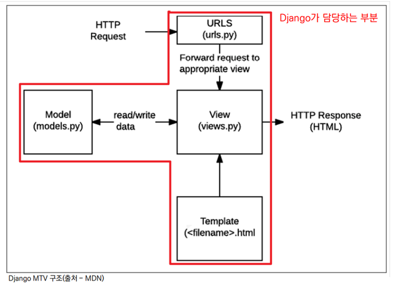

# Django

## Framework

- Frame(뼈대, 틀) + Work(일하다)
  - 일정한 뼈대, 틀을 가지고 일하다
  - 제공받은 도구들과 뼈대, 규약을 가지고 무언가를 만드는 일
  - 특정 프로그램을 개발하기 위한 여러 도구들과 규약을 제공하는 것
- 서비스 개발에 필요한 기능들을 미리 구현해서 모아 놓은 것

- '소프트웨어 프레임워크'는 복잡한 문제를 해결하거나 서술하는 데 사용되는 기본 개념 구조
- 소프트웨어의 생산성과 품질을 높임

### Framework의 성격

- 독선적(Opinionated)
  - 독선적인 프레임워크들은 어떤 특정 작업을 다루는 ‘올바른 방법’에 대한 분명한 의견(규약)을 가지고 있음
  - 대체로 특정 문제내에서 빠른 개발방법을 제시
  - 어떤 작업에 대한 올바른 방법이란 보통 잘 알려져 있고 문서화가 잘 되어있기 때문
  - 하지만 주요 상황을 벗어난 문제에 대해서는 그리 유연하지 못한 해결책을 제시할 수 있음

- 관용적(Unopinionated)
  - 관용적인 프레임워크들은 구성요소를 한데 붙여서 해결해야 한다거나 심지어 어떤 도구를 써야 한다는 '올바른 방법'에 대한 제약이 거의 없음
  - 이는 개발자들이 특정 작업을 완수하는데 가장 적절한 도구들을 이용할 수 있는 자유도가 높음
  - 하지만 개발자 스스로가 그 도구들을 찾아야 한다는 수고가 필요


### Django Framework의 성격

- '다소 독선적'
  - 양쪽 모두에게 최선의 결과를 준다고 강조
- 현대 개발에 있어서는 가장 중요한 것들 중 하나는 '생산성'
- 프레임워크는 개발을 방해하려고 규칙, 제약을 만들어 놓은 것이 아닌, 온전히 만들고자 하는 것에만 집중할 수 있게 도와주는 것

## 클라이언트와 서버

| CLIENT | requests<br/>-----------------><br/><-----------------<br/>responses | SERVER |
| :----: | :----------------------------------------------------------: | :----: |

- 클라이언트
  - 웹 사용자의 인터넷에 연결된 장치 (예를 들어 wi-fi에 연결된 컴퓨터 또는 모바일)
  - Chrome 또는 Firefox와 같은 웹 브라우저
  - 서비스를 요청하는 주체
- 서버
  - 웹 페이지, 사이트 또는 앱을 저장하는 컴퓨터
  - 클라이언트가 웹 페이지에 접근하려고 할 때 서버에서 클라이언트 컴퓨터로 웹 페이지 데이터를 응답해 사용자의 웹 브라우저에 표시됨
  - 요청에 대해 서비스를 응답하는 주체
- 상호작용 예시
  - Google 홈페이지에 접속
  - 인터넷에 연결된 전세계 어딘가에 있는 구글 컴퓨터에게 ‘Google 홈페이지.html’ 파일을 달라고 요청하는 것
  - 구글 컴퓨터는 우리의 요청을 받고 ‘Google 홈페이지.html’ 파일을 인터넷을 통해서 우리 컴퓨터에게 응답해줌
  - 그렇게 전달받은 Google 홈페이지.html 파일을 웹 브라우저가 우리가 볼 수 있도록 해석해주는 것
  - 여기서 'Google 홈페이지.html'을 달라고 요청한 컴퓨터, 웹 브라우저는 클라이언트
  - 'Google 홈페이지.html' 파일을 제공한 컴퓨터, 프로그램을 서버
  -  어떠한 자원(resource)를 달라고 요청(request)하는 쪽을 클라이언트라고 하고 자원을 제공해주는 쪽을 서버(server)라고 함

## 웹 브라우저와 웹 페이지

- 웹 브라우저
  - 웹에서 페이지를 찾아 보여주고, 사용자가 하이퍼링크를 통해 다른 페이지로 이동할 수 있도록 하는 프로그램
  - 웹 페이지 파일을 우리가 보는 화면으로 바꿔주는(렌더링, rendering) 프로그램
- 웹 브라우저 예시
  - 우리가 보고 있는 웹 페이지는 사실 HTML 문서 파일 하나
  - 웹 페이지 코드를 받으면 우리가 보는 화면처럼 바꿔주는 것이 바로 웹 브라우저
  - HTML / CSS / JS 등의 코드를 읽어 실제 사람이 볼 수 있는 화면으로 만들어 줌
- 웹 페이지
  - 웹에 있는 문서, 우리가 보는 화면 각각 한 장 한 장이 웹 페이지
  -  정적 웹 페이지, 동적 웹 페이지가 있음
- 정적 웹 페이지
  - Static Web page
  - 있는 그대로를 제공하는 것(served as-is)을 의미
  - 한 번 작성된 HTML 파일의 내용이 변하지 않 고 모든 사용자에게 동일한 모습으로 전달되는 것
    - 서버에 미리 저장된 HTML 파일 그대로 전달된 웹 페이지
    - 같은 상황에서 모든 사용자에게 동일한 정보를 표시
- 동적 웹 페이지
  - Dynamic Web page
  - 사용자의 요청에 따라 웹 페이지에 추가적인 수정이 되어 클라이언트에게 전달되는 웹 페이지
  - 웹 페이지의 내용을 바꿔주는 주체는 서버
    - 서버에서 동작하고 있는 프로그램이 웹 페이지를 변경해줌
    - 사용자의 요청을 받아서 적절한 응답을 만들어주는 프로그램을 쉽게 만들 수 있게 도와주는 프레임워크가 존재함
      - ex) **Django**, Spring Boot, Express 등
  - 다양한 서버 사이드 프로그래밍 언어(python, java, c++ 등) 사용 가능
  - 파일을 처리하고 데이터베이스와의 상호작용이 이루어짐

## IP와 도메인

- 네트워크에 연결된 모든 컴퓨터에는 IP 주소 (IP는 인터넷 프로토콜)라는 고유한 주소가 있음
- IPv4 주소는 점으로 구분 된 네 개의 숫자로 구성된 주소
  - 기억하기 어렵다는 단점이 있음
- IP 주소를 사람이 기억하기 쉽도록 도메인 이름을 지정해 매핑할 수 있음
  - ex) 'google.com'은 IP 주소로 '173.194.121.32'

## HTTP

- Hyper Text Transper Protocol
- HTML 문서와 같은 리소스들을 가져올 수 있도록 해주는 프로토콜
- 웹에서 이루어지는 모든 데이터 교환의 기초이며, 클라이언트-서버 프로토콜이기도 함
- 브라우저인 클라이언트에 의해 전송되는 메시지는 요청(requests)이라고 부름
  - HTTP 메소드 (GET, POST, OPTIONS, HEAD)
  - 가져오려는 리소스의 경로, 프로토콜 (http://), 도메인 (en-US), TCP 포트 (en-US), URL
  - HTTP 프로토콜의 버전
  - 서버에 대한 추가 정보를 전달하는 선택적 헤더들
  - POST와 같은 몇 가지 메서드를 위한 본문
- 서버에서 응답으로 전송되는 메시지를 응답(responses)이라고 부름
  - HTTP 프로토콜의 버전
  - 요청의 성공 여부와, 그 이유를 나타내는 상태 코드
  - 상태 코드의 짧은 설명을 나타내는 상태 메시지 (영향력 없음)
  - HTTP 헤더들
  - 선택 사항으로, 가져온 리소스가 포함되는 본문

## Django 구조 (MTV Design Pattern)

- 각기 다른 기능을 가진 다양한 응용 소프트웨어를 개발할 때 공통적인 설계 문제가 존재
- 이를 처리하는 해결책 사이에도 공통점이 있다는 것을 발견, 이러한 유사점을 패턴이라 함
- 클라이언트-서버 구조도 소프트웨어 디자인 패턴 중 하나
- 특정 문맥에서 공통적으로 발생하는 문제에 대해 재사용 가능한 해결책을 제시

### MVC 소프트웨어 디자인 패턴

- 데이터 및 논리 제어를 구현하는데 널리 사용되는 소프트웨어 디자인 패턴
- Model - View – Controller
  - Model : 데이터와 관련된 로직을 관리
  - View : 레이아웃과 화면을 처리
  - Controller : 명령을 model과 view 부분으로 연결
- 각 부분을 독립적으로 개발할 수 있어, 하나를 수정하고 싶을 때 모두 건들지 않아도 됨

### MTV 소프트웨어 디자인 패턴



- Model - Template – View
  - Model
    - MVC 패턴에서 Model의 역할에 해당
    - 데이터와 관련된 로직을 관리
    - 응용프로그램의 데이터 구조를 정의하고 데이터베이스의 기록을 관리
  - Template
    - MVC 패턴에서 View의 역할에 해당
    - 레이아웃과 화면을 처리
    - 화면상의 사용자 인터페이스 구조와 레이아웃을 정의
  - View
    - MVC 패턴에서 Controller의 역할에 해당
    - Model & Template과 관련한 로직을 중간 처리해서 응답을 반환
    - 클라이언트의 요청에 대해 처리를 분기하는 역할
    - 데이터가 필요하다면 model에 접근해서 데이터를 가져오고, 가져온 데이터를 template로 보내 화면을 구성하고, 구성된 화면을 응답으로 만들어 클라이언트에게 반환

### Django의 설계 철학 (Templates System)

1. 표현과 로직(view)을 분리
   - 템플릿 시스템은 표현을 제어하는 도구이자 표현에 관련된 로직일 뿐
   - 즉, 템플릿 시스템은 이러한 기본 목표를 넘어서는 기능을 지원하지 말아야 함
2. 중복을 배제
   - 대다수의 동적 웹사이트는 공통 header, footer, navbar 같은 사이트 공통 디자인을 가짐
   - Django 템플릿 시스템은 이러한 요소를 한 곳에 저장하기 쉽게 하여 중복 코드를 없애야 함
   - 템플릿 상속의 기초가 되는 철학

## 개발 환경 설정

1. 가상 환경 생성 및 실행

   ```bash
   $ mkdir [folder_name]
   $ cd [folder_name]
   $ python -m venv server-venv
   # python -m venv [venv_name]
   $ source server-venv/Scripts/activate
   ```

2. pip 버전 업그레이드

   ```bash
   $ sudo python -m pip install --upgrade pip
   # for Mac, Windows
   
   $ pip install --upgrade pip
   # for Linux
   
   $ pip --version
   ```

3. Django LTS 버전 설치 및 패키지 목록 생성

   ```bash
   (server-venv)
   $ pip install django==3.2.13
   $ pip freeze > requirements.txt
   ```

4. Django 프로젝트 생성

   ```bash
   (server-venv)
   $ django-admin startproject firstpjt .
   # django-admin startproject [project_name] [start_path]
   # Project 이름에는 Python이나 Django에서 사용 중인 키워드 및 `-`(하이픈) 사용 불가
   # '.' (dot)을 붙이지 않을 경우 현재 디렉토리에 프로젝트 디렉토리를 새로 생성하게 됨
   $ code .  # vscode로 열기
   ```

5. Django 서버 실행

   ```bash
   (server-venv)
   $ python manage.py runserver
   ```

6. 접속 테스트

   `http://localhost:8000`

7. 서버 및 가상 환경 끄기

   ```bash
   $ ^C  # Ctrl + C, server 종료하기
   $ deactivate  # 가상환경 끄기
   ```

   

### 프로젝트 구조

- `__init__.py`
  - Python에게 이 디렉토리를 하나의 Python 패키지로 다루도록 지시
  - 별도로 추가 코드를 작성하지 않음
- `asgi.py`
  - Asynchronous Server Gateway Interface
  - Django 애플리케이션이 비동기식 웹 서버와 연결 및 소통하는 것을 도움
- `settings.py`
  - Django 프로젝트 설정을 관리
- `urls.py`
  - 사이트의 url과 적절한 views의 연결을 지정

- `wsgi.py`
  - Web Server Gateway Interface
  - Django 애플리케이션이 웹 서버와 연결 및 소통하는 것을 도움

- `manage.py`

  - Django 프로젝트와 다양한 방법으로 상호작용 하는 커맨드라인 유틸리티

  ```bash
  # manage.py Usage
  $ python manage.py <command> [options]
  ```

### 애플리케이션(앱) 생성

```bash
$ python manage.py startapp articles
# 일반적으로 애플리케이션 이름은 ‘복수형’으로 작성하는 것을 권장
```

### 애플리케이션 구조

- `admin.py`

  - 관리자용 페이지를 설정 하는 곳

- `apps.py`

  - 앱의 정보가 작성된 곳
  - 별도로 추가 코드를 작성하지 않음

- `models.py`

  - 애플리케이션에서 사용하는 Model을 정의하는 곳
  - MTV 패턴의 M에 해당

- `tests.py`

  - 프로젝트의 테스트 코드를 작성하는 곳

- `views.py`

  - view 함수들이 정의 되는 곳
  - MTV 패턴의 V에 해당

- 프로젝트에서 앱을 사용하기 위해서는 반드시 INSTALLED_APPS 리스트에 반드시 추가해야 함

  ```python
  # settings.py
  INSTALLED_APPS = [
      # Local apps
      'articles',
      
      # Third party apps
      'haystack',
  
      # Django apps
      'django.contrib.admin',
      'django.contrib.auth',
      'django.contrib.contenttypes',
      'django.contrib.sessions',
      'django.contrib.sites',
  ]
  # 반드시 생성 후 등록
  ```

  - INSTALLED_APPS :  Django installation에 활성화 된 모든 앱을 지정하는 문자열 목록

### 프로젝트와 애플리케이션

- 프로젝트
  - "collection of apps"
  - 프로젝트는 앱의 집합
  - 프로젝트에는 여러 앱이 포함될 수 있음
  - 앱은 여러 프로젝트에 있을 수 있음
- 애플리케이션
  - 앱은 실제 요청을 처리하고 페이지를 보여주는 등의 역할을 담당
  - 일반적으로 앱은 하나의 역할 및 기능 단위로 작성하는 것을 권장함

