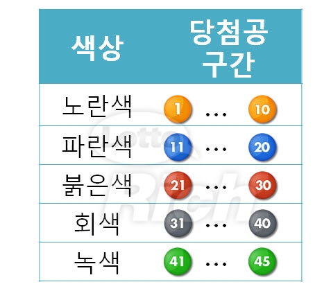

# 웹 09 - JS 04

Date: 2022년 9월 20일
회차: 2회차

> 🔥 오늘의 일정 
>
> ~15:40 : 실습
> ~16:00 : 쉬는시간
> ~17:00 : 평가 (HTML/CSS, JS)
> ~17:50 : 웹 과정 정리 및 DB 재평가
> 
> 반드시 평가를 제출하셔야합니다.

## 실습

### 기본

- 버튼을 눌렀을 때 번호 6개를 추천하는 코드를 작성합니다.
- 라이브 수업에서 진행된 코드를 참고하여 완성 시키세요.

### 추가 기능

- 숫자별로 적절한 색상을 활용합니다.
  
    
    
- 사용자에게 정보를 받아 주어진 수량의 번호를 한번에 제공합니다.
- GitHub Pages 기능을 활용하여 배포합니다.

> 🔥 완성된 코드와 GitHub Pages로 배포된 URL을 제출합니다.
