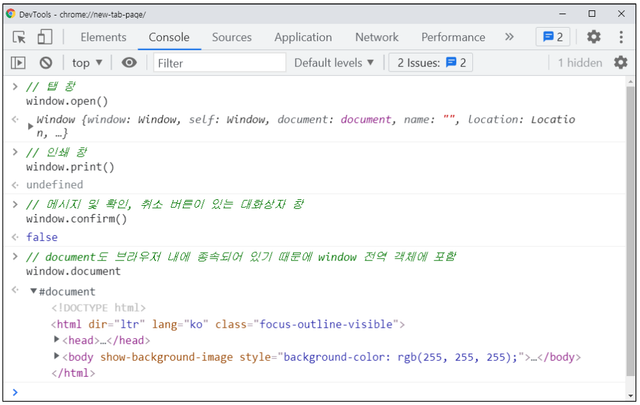
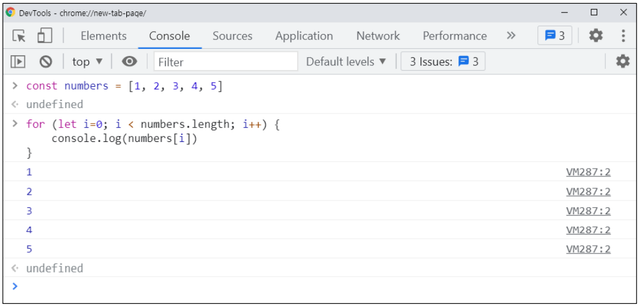

# JavaScript

## 필요성

- 브라우저 화면을 '동적' 으로 만들기 위함
- 브라우저를 조작할 수 있는 유일한 언어

## 브라우저에서 할 수 있는 일

- DOM 조작
  - 문서(HTML) 조작
- BOM 조작
  - navigator, screen, location, frames, history, XHR
- JavaScript Core (ECMAScript)
  - Data Structure(Object, Array), Conditional Expression, Iteration
- 브라우저(BOM)과 그 내부의 문서(DOM)를 조작하기 위해 ECMAScript(JS)를 학습

### DOM (Document Object Model)

- HTML, XML과 같은 문서를 다루기 위한 문서 프로그래밍 인터페이스
- 문서를 구조화하고 구조화된 구성 요소를 하나의 객체로 취급하여 다루는 논리적 트리 모델
- 문서가 구조화되어 있으며 각 요소는 객체(object)로 취급
- 단순한 속성 접근, 메소드 활용 뿐만 아니라 프로그래밍 언어적 특성을 활용한 조작 가능
- 주요 객체
  - window : DOM을 표현하는 창. 가장 최상위 객체 (작성 시 생략 가능)
  - document : 페이지 컨텐츠의 Entry Point 역할을 하며,  등과 같은 수많은 다른 요소들을 포함
  - navigator, location, history, screen
- 파싱 (Parsing)
  - 구문 분석, 해석
  - 브라우저가 문자열을 해석하여 DOM Tree로 만드는 과정

### BOM (Browser Object Model)

- 자바스크립트가 브라우저와 소통하기 위한 모델
- 브라우저의 창이나 프레임을 추상화해서 프로그래밍적으로 제어할 수 있도록 제공하는 수단
  - 버튼, URL 입력창, 타이틀 바 등 브라우저 윈도우 및 웹 페이지 일부분을 제어 가능
- window 객체는 모든 브라우저로부터 지원받으며 브라우저의 창(window)을 지칭

### JavaScript Core

- 프로그래밍 언어

## DOM 조작

|  |  |
| :----------------------------------------------------------: | :-------------------------: |

- Document는 문서 한 장(HTML)에 해당하고 이를 조작
- DOM 조작 순서
  1. 선택 (Select)
  2. 변경 (Manipulation)
- DOM 객체의 상속 구조
  - EventTarget
    - Event Listener를 가질 수 있는 객체가 구현하는 DOM 인터페이스
  - Node
    - 여러 가지 DOM 타입들이 상속하는 인터페이스
  - Element
    - Document 안의 모든 객체가 상속하는 가장 범용적인 인터페이스
    - 부모인 Node와 그 부모인 EventTarget의 속성을 상속
  - Document
    - 브라우저가 불러온 웹 페이지를 나타냄
    - DOM 트리의 진입점(entry point) 역할을 수행
  - HTMLElement
    - 모든 종류의 HTML 요소
    - 부모 element의 속성 상속

### DOM 선택

- `document.querySelector(selector)`
  - 제공한 선택자와 일치하는 element 하나 선택
  - 제공한 CSS selector를 만족하는 첫 번째 element 객체를 반환 (없다면 null)
- `document.querySelectorAll(selector)`
  - 제공한 선택자와 일치하는 여러 element를 선택
  - 매칭할 하나 이상의 selector를 포함하는 유효한 CSS selector를 인자(문자열)로 받음
  - 지정된 selector에 일치하는 NodeList를 반환
- `getElementById(id)`
- `getElementsByTagName(name)`
- `getElementsByClassName(names)`
- `querySelector()`, `querySelectorAll()`을 사용하는 이유
  - id, class 그리고 tag 선택자 등을 모두 사용 가능하므로, 더 구체적이고 유연하게 선택 가능
  - `document.querySelector('#id’)`, `document.querySelectAll(‘.class')`
- 선택 메소드별 반환 타입
  1. 단일 element
     - *`getElementById()`*
     - **`querySelector()`**
  2. HTMLCollection
     - *`getElementsByTagName()`*
     - *`getElementsByClassName()`*
  3. NodeList
     - **`querySelectorAll()`**
- HTMLCollection & NodeList
  - 둘 다 배열과 같이 각 항목에 접근하기 위한 index를 제공 (유사 배열)
  - HTMLCollection
    - name, id, index 속성으로 각 항목에 접근 가능
  - NodeList
    - index로만 각 항목에 접근 가능
    - 단, HTMLCollection과 달리 배열에서 사용하는 forEach 메소드 및 다양한 메소드 사용 가능
  - 둘 다 Live Collection으로 DOM의 변경사항을 실시간으로 반영
    - 단, **querySelectorAll()에 의해 반환되는 NodeList는 Static Collection으로 실시간으로 반영되지 않음**
- Collection
  - Live Collection
    - 문서가 바뀔 때 실시간으로 업데이트 됨
    - DOM의 변경사항을 실시간으로 collection에 반영
    -  HTMLCollection, NodeList
  - Static Collection (non-live)
    - DOM이 변경되어도 collection 내용에는 영향을 주지 않음
    - querySelectorAll()의 반환 NodeList만 static collection

### DOM 변경

- `document.createElement()`
  - 작성한 태그 명의 HTML 요소를 생성하여 반환
- `Element.append()`
  - 특정 부모 Node의 자식 NodeList 중 마지막 자식 다음에 Node 객체나 DOMString을 삽입
  - 여러 개의 Node 객체, DOMString을 추가 할 수 있음
  - 반환 값이 없음
- `Node.appendChild()`
  - 한 Node를 특정 부모 Node의 자식 NodeList 중 마지막 자식으로 삽입 (Node만 추가 가능)
  - 한번에 오직 하나의 Node만 추가할 수 있음
  - 만약 주어진 Node가 이미 문서에 존재하는 다른 Node를 참조한다면 새로운 위치로 이동
- `ParentNode.append()` vs `Node.appendChild()`
  - `append()`를 사용하면 DOMString 객체를 추가할 수도 있지만, `appendChild()`는 Node 객체만 허용
  - `append()`는 반환 값이 없지만, `appendChild()`는 추가된 Node 객체를 반환
  - `append()`는 여러 Node 객체와 문자열을 추가할 수 있지만, `appendChild()`는 하나의 Node 객체만 추가할 수 있음
- `Node.innerText`
  - Node 객체와 그 자손의 텍스트 컨텐츠(DOMString)를 표현
    - (해당 요소 내부의 raw text, 사람이 읽을 수 있는 요소만 남김)
  - 즉, 줄 바꿈을 인식하고 숨겨진 내용을 무시하는 등 최종적으로 스타일링이 적용된 모습으로 표현

- *`Element.innerHTML`*
  - 요소(element) 내에 포함된 HTML 마크업을 반환
  - XSS 공격에 취약하므로 사용을 권장하지 않음
  - XSS (Cross-site Scripting)
    - 공격자가 입력 요소를 사용하여 웹 사이트 클라이언트 측 코드에 악성 스크립트를 삽입 해 공격하는 방법
    - 피해자(사용자)의 브라우저가 악성 스크립트를 실행하며 공격자가 액세스 제어를 우회하고 사용자를 가장할 수 있도록 함
- `ChildNode.remove()`
  - Node가 속한 트리에서 해당 Node를 제거
- `Node.removeChild()`
  - DOM에서 자식 Node를 제거하고 제거된 Node를 반환
  - Node는 인자로 들어가는 자식 Node의 부모 Node
- `Element.setAttribute(name, value)`
  - 지정된 요소의 값을 설정
  - 속성이 이미 존재하면 값을 갱신, 존재하지 않으면 지정된 이름과 값으로 새 속성을 추가
- `Element.getAttribute(attributeName)`
  - 해당 요소의 지정된 값(문자열)을 반환
  - 인자(attributeName)는 값을 얻고자 하는 속성의 이름

### DOM 조작 정리

1. 선택
   - `querySelector()`
   - `querySelectorAll()`
   - ...
2. 변경(조작)
   - `innerText`
   - `innerHTML`
   - `element.style.color`
   - `setAttribute()`
   - `getAttribute()`
   - `createElement()`
   - `appendChild()`
   - `removeChild()`
   - ...

## 참고 사이트

- MDN 문서를 활용한 문법 학습
  - [https://developer.mozilla.org/ko/docs/Web/JavaScript](https://developer.mozilla.org/ko/docs/Web/JavaScript)
  - [https://developer.mozilla.org/ko/docs/Learn/JavaScript](https://developer.mozilla.org/ko/docs/Learn/JavaScript)
  - [https://developer.mozilla.org/ko/docs/Web/JavaScript/Guide](https://developer.mozilla.org/ko/docs/Web/JavaScript/Guide)

- 시작 : [https://developer.mozilla.org/ko/docs/Learn/JavaScript/First_steps/What_is_JavaScript](https://developer.mozilla.org/ko/docs/Learn/JavaScript/First_steps/What_is_JavaScript)
- 문법과 자료형 : [https://developer.mozilla.org/ko/docs/Web/JavaScript/Guide/Grammar_and_types](https://developer.mozilla.org/ko/docs/Web/JavaScript/Guide/Grammar_and_types)
- 제어문 : [https://developer.mozilla.org/ko/docs/Web/JavaScript/Guide/Control_flow_and_error_handling](https://developer.mozilla.org/ko/docs/Web/JavaScript/Guide/Control_flow_and_error_handling)
- 반복 : [https://developer.mozilla.org/ko/docs/Web/JavaScript/Guide/Loops_and_iteration](https://developer.mozilla.org/ko/docs/Web/JavaScript/Guide/Loops_and_iteration)
- 함수 : [https://developer.mozilla.org/ko/docs/Web/JavaScript/Guide/Functions](https://developer.mozilla.org/ko/docs/Web/JavaScript/Guide/Functions)
- 표현식 연산자 : [https://developer.mozilla.org/ko/docs/Web/JavaScript/Guide/Expressions_and_Operators](https://developer.mozilla.org/ko/docs/Web/JavaScript/Guide/Expressions_and_Operators)