# JavaScript

## Event 정의

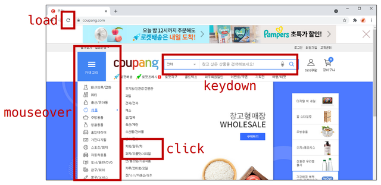

> "특정 이벤트가 발생하면, 할 일(함수)을 등록한다."

- 네트워크 활동이나 사용자와의 상호작용 같은 사건의 발생을 알리기 위한 객체
- 이벤트 발생
  - 마우스를 클릭하거나 키보드를 누르는 등 사용자 행동으로 발생할 수 있음
  - 특정 메소드를 호출(Element.click())하여 프로그래밍적으로 만들어 낼 수 있음

## Event handler

### addEventListener()

| 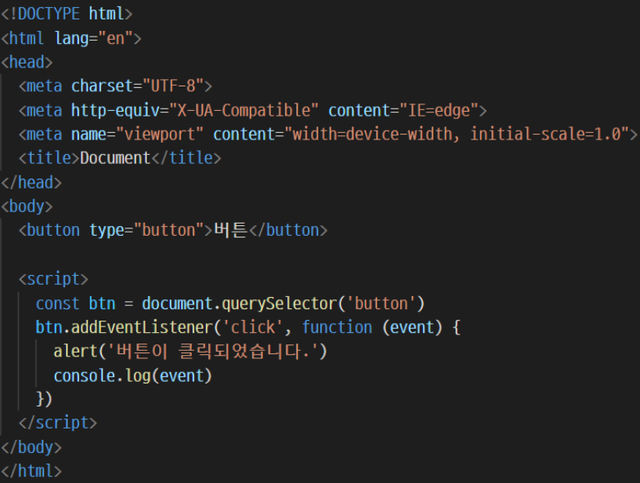 | 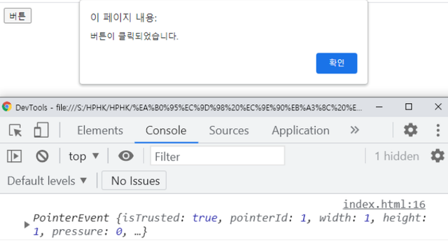 |
| ----------------------------- | ----------------------------- |

- **`EventTarget.addEventListener(type, listener[, options])`**

  > "대상(EventTarget)에 특정 이벤트(type)가 발생하면, 할 일(listener)을 등록하자"

  - 지정한 이벤트가 대상에 전달될 때마다 호출할 함수를 설정
  - 이벤트를 지원하는 모든 객체(Element, Document, Window 등)를 대상으로 지정 가능
  - type
    - 반응 할 이벤트 유형 (대소문자 구분 문자열)
  - listener
    - 지정된 타입의 이벤트가 발생했을 때 알림을 받는 객체
    - EventListener 인터페이스 혹은 JS function 객체(callback 함수)여야 함

- 예시 1

  ```html
  <button onclick="alertMessage()">나를 눌러봐!</button>
  ```

  ```javascript
  const alertMessage = function () {
    alert('메롱!!!')
  }
  ```

  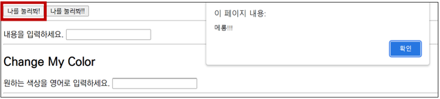

- 예시 2

  ```html
  <button id="my-button">나를 눌러봐!!</button>
  ```

  ```javascript
  const myButton = document.querySelector('#my-button')
  myButton.addEventListener('click', function () {
    alert('메롱!!!')
  })
  ```

  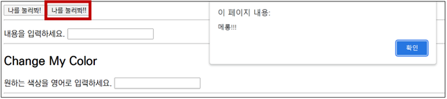

- 예시 3

  ```html
  <p id="my-paragraph"></p>
  <form action="#">
    <label for="my-text-input">내용을 입력하세요.</label>
    <input id="my-text-input" type="text">
  </form>
  ```

  ```javascript
  const myTextInput = document.querySelector('#my-text-input')
  myTextInput.addEventListener('input', function (event) {
    // console.log(event)
    const myPtag = document.querySelector('#my-paragraph')
    myPtag.innerText = event.target.value
  })
  ```

  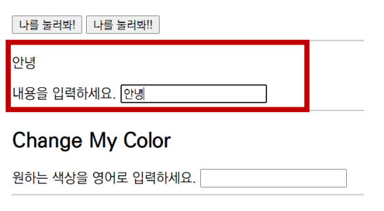

- 예시 4

  ```html
  <h2>Change My Color</h2>
  <label for="change-color-input">원하는 색상을 영어로 입력하세요.</label>
  <input id="change-color-input" type="text">
  <hr>
  ```

  ```javascript
  const colorInput = document.querySelector('#change-color-input')
  const changeColor = function (event) {
    const h2Tag = document.querySelector('h2')
    h2Tag.style.color = event.target.value
  }
  colorInput.addEventListener('input', changeColor)
  ```

  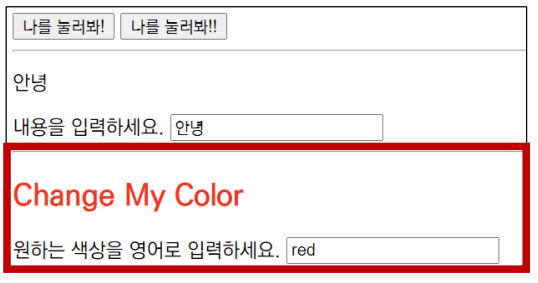

## Event 취소

### preventDefault()

- **`event.preventDefault()`**

  - 현재 이벤트의 기본 동작을 중단

  - HTML 요소의 기본 동작을 작동하지 않게 막음
    - ex) a 태그의 기본 동작은 클릭 시 링크로 이동 / form 태그의 기본 동작은 form 데이터 전송

  - 이벤트를 취소할 수 있는 경우, 이벤트의 전파를 막지 않고 그 이벤트를 취소

- 예시 1

  ```html
  <input type="checkbox" id="my-checkbox">
  ```

  ```javascript
  const checkBox = document.querySelector('#my-checkbox')
  checkBox.addEventListener('click', function (event) {
      event.preventDefault()
      console.log(event)
  })
  ```

  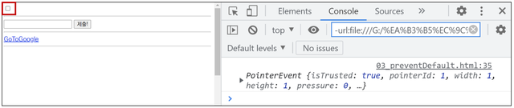

- 예시 2  

  ```html
  <form action="/articles/" id="my-form">
    <input type="text">
    <input type="submit" value="제출!">
  </form>
  ```
  
  ```javascript
  const formTag = document.querySelector('#my-form')
  formTag.addEventListener('submit', function (event) {
      console.log(event)
      event.preventDefault()
      event.target.reset()
  })
  ```
  
  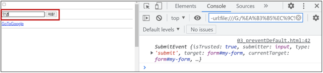

- 예시 3

  ```html
  <a href="https://google.com/" target="_blank" id="my-link">GoToGoogle</a>
  ```

  ```javascript
  const aTag = document.querySelector('#my-link')
  aTag.addEventListener('click', function (event) {
      console.log(event)
      event.preventDefault()
  })
  ```

  

- 예시 4

  ```javascript
  document.addEventListener('scroll', function (event) {
      console.log(event)
      event.preventDefault()
  })
  ```

  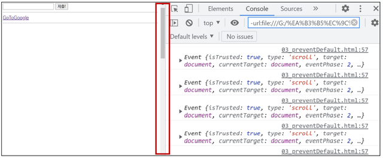

- 취소 할 수 없는 이벤트도 존재

  - 이벤트의 취소 가능 여부는 event.cancelable을 사용해 확인할 수 있음

  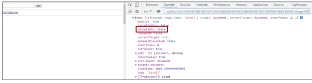

## Event bubbling

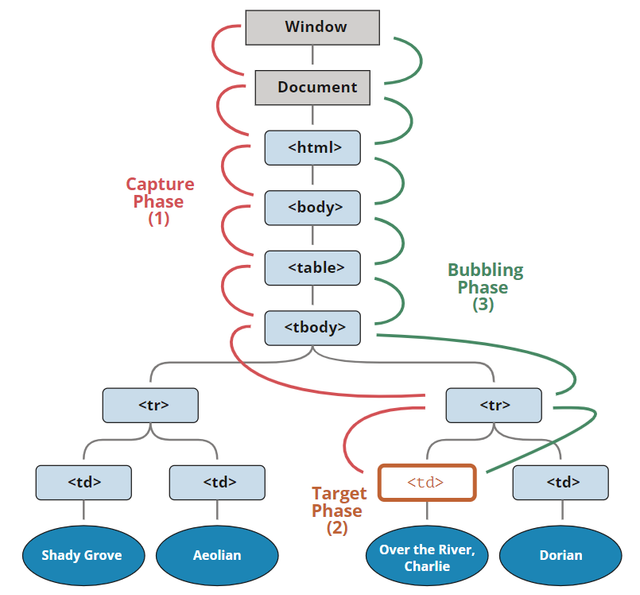

- 한 요소에 이벤트가 발생하면, 이 요소에 할당된 핸들러가 동작하고, 이어서 부모 요소의 핸들러가 동작함
- 가장 상단의 조상 요소를 만날 때까지 이 과정이 반복되면서 요소 각각에 할당된 핸들러가 동작함
- 이벤트가 제일 깊은 곳에 있는 요소부터 시작해 부모 요소를 거슬러 올라가는 모양이 거품과 닮아서 버블링이라 부름

```html
<style>
  body * {
    margin: 10px;
    border: 1px solid blue;
  }
</style>

<form onclick="alert('form')">FORM
  <div onclick="alert('div')">DIV
    <p onclick="alert('p')">P</p>
  </div>
</form>
```

- 가장 안쪽의 `<p>`를 클릭할 경우

  1. `<p>`에 할당된 onclick 핸들러가 동작
  
  2. 바깥의 `<div>`에 할당된 핸들러가 동작
  
  3. 그 바깥의 `<form>`에 할당된 핸들러가 동작
  
  4. `document` 객체를 만날 때까지, 각 요소에 할당된 `onclick` 핸들러가 동작
  
### event.target vs this(event.currentTarget)

  - `event.target`: 실제 이벤트가 시작된 '타깃' 요소, 버블링이 진행되어도 변하지 않음
  - `this` : '현재' 요소, 현재 실행 중인 핸들러가 할당된 요소를 참조


```html
<!DOCTYPE HTML>
<html>
<head>
  <meta charset="utf-8">
  <link rel="stylesheet" href="example.css">
</head>
<body>
  클릭하면 <code>event.target</code>과 <code>this</code>정보를 볼 수 있습니다.

  <form id="form">FORM
    <div>DIV
      <p>P</p>
    </div>
  </form>

  <script src="script.js"></script>
</body>
</html>
```

```css
form {
  background-color: green;
  position: relative;
  width: 150px;
  height: 150px;
  text-align: center;
  cursor: pointer;
}

div {
  background-color: blue;
  position: absolute;
  top: 25px;
  left: 25px;
  width: 100px;
  height: 100px;
}

p {
  background-color: red;
  position: absolute;
  top: 25px;
  left: 25px;
  width: 50px;
  height: 50px;
  line-height: 50px;
  margin: 0;
}

body {
  line-height: 25px;
  font-size: 16px;
}
```

```javascript
form.onclick = function(event) {
  event.target.style.backgroundColor = 'yellow';

  // chrome needs some time to paint yellow
  setTimeout(() => {
    alert("target = " + event.target.tagName + ", this=" + this.tagName);
    event.target.style.backgroundColor = ''
  }, 0);
};
```

- `form.onclick` 핸들러 내의 `this`와 `event.target`의 차이
  - `this`(`event.currentTarget`) – `<form>` 요소에 있는 핸들러가 동작했기 때문에 `<form>` 요소를 가리킴
  - `event.target` – 폼 안쪽에 있는 실제 클릭한 요소를 가리킴

### Bubbling 중단하기

#### stopPropagation()

- 이벤트 객체의 메소드인 `event.stopPropagation()`를 사용
- 위쪽으로 일어나는 버블링은 막아주지만, 다른 핸들러들이 동작하는 건 막지 못함
  - 버블링을 멈추고, 요소에 할당된 다른 핸들러의 동작도 막으려면 `event.stopImmediatePropagation()`을 사용해야 함
- **버블링을 꼭 멈춰야 하는 명백한 상황이 아니라면 막지 말 것!**

## 참고 사이트

- 이벤트
  - [EventTarget.addEventListener() - Web API | MDN (mozilla.org)](https://developer.mozilla.org/ko/docs/Web/API/EventTarget/addEventListener)
  - [이벤트 참조 | MDN (mozilla.org)](https://developer.mozilla.org/ko/docs/Web/Events)
  - [함수 만들기 - Web 개발 학습하기 | MDN (mozilla.org)](https://developer.mozilla.org/ko/docs/Learn/JavaScript/Building_blocks/Build_your_own_function)

- (심화) 애니메이션 - CSS
  - [CSS 애니메이션 사용하기 - CSS: Cascading Style Sheets | MDN (mozilla.org)](https://developer.mozilla.org/ko/docs/Web/CSS/CSS_Animations/Using_CSS_animations)
  - [Animations (web.dev)](https://web.dev/learn/css/animations/)
  - [Transitions (web.dev)](https://web.dev/learn/css/transitions/)

- 버블링과 캡쳐링
  - [버블링과 캡처링 (javascript.info)](https://ko.javascript.info/bubbling-and-capturing)