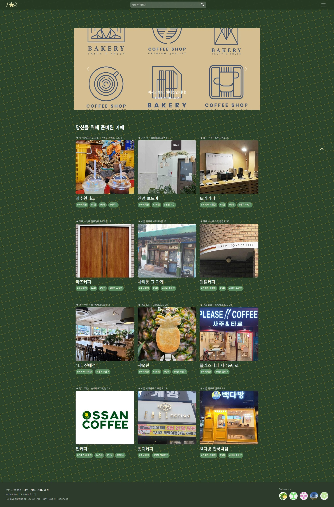
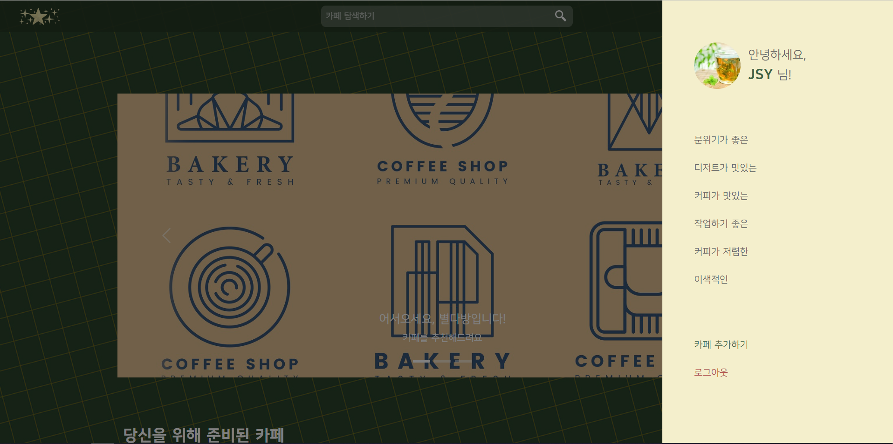
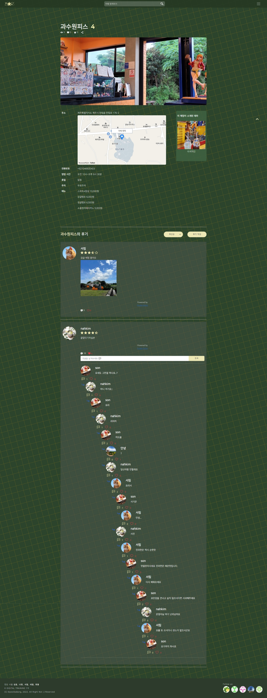
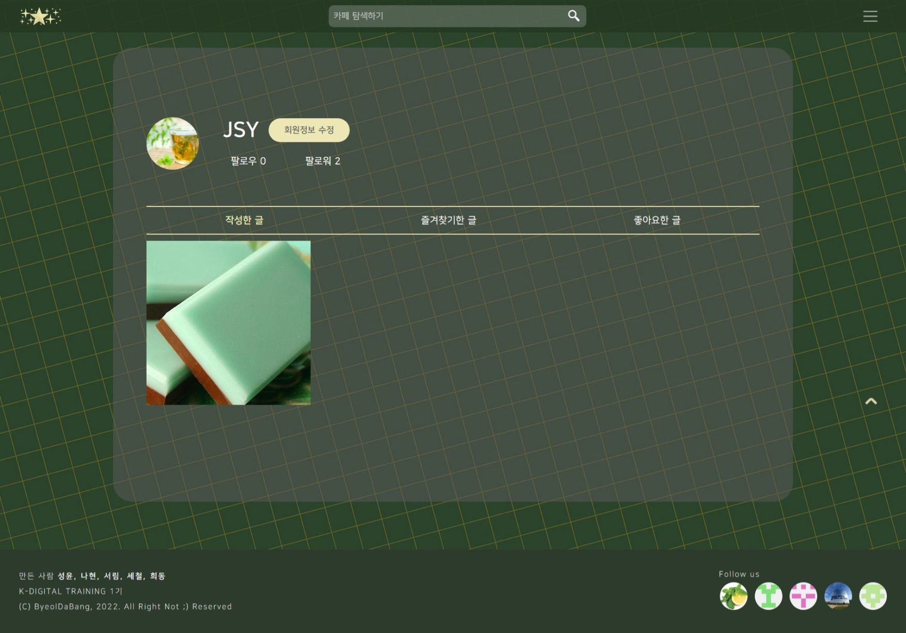
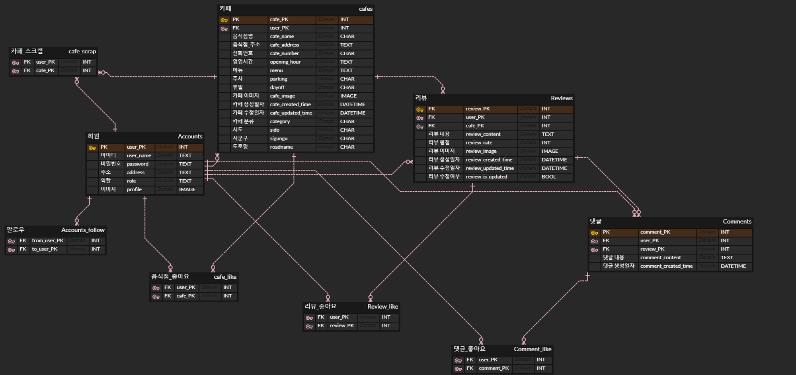

# 🍧 별다방

🔗 [배포 URL](http://semipjt1122-env.eba-apivr4wu.ap-northeast-2.elasticbeanstalk.com)

## 개요

- 🍩 별다방은 카페에 대한 후기 작성 & 카페 리스트를 확인하는 서비스입니다.
- 🔍 카페를 최신순으로 정렬, 지역 & 이름 & 카테고리 검색이 가능합니다.
- ⭐ 마이페이지에서 작성한 글 / 좋아요한 글 / 스크랩한 글 / 팔로우한 유저 별로 볼 수 있습니다.
- 💖 피드를 구경하다가 마음에 드는 글(후기)을 발견한다면 좋아요, 스크랩(saved) 할 수 있습니다.
- 💬 글 상세 페이지에서 리뷰, 댓글, 대댓글을 작성할 수 있습니다.
- ❌ 과도한 비방글은 삭제됩니다.

## 프로젝트 결과

- 메인

- 사이드메뉴

- 상세페이지

- 마이페이지

## 화면 설계

🔗 [피그마 URL](https://www.figma.com/file/4hhOkRZrAzStZMRCVudBMu/Untitled?node-id=0%3A1)

## 모델링 설계

🔗 [ERD URL](https://www.erdcloud.com/d/RbGaBFTTN9tycRBWe)

