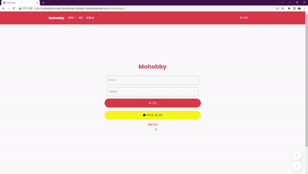
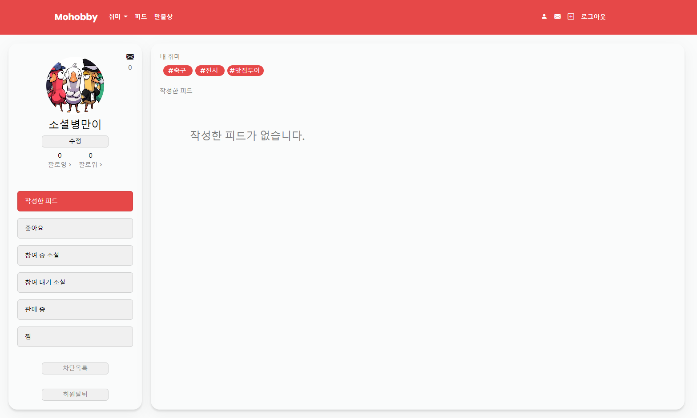
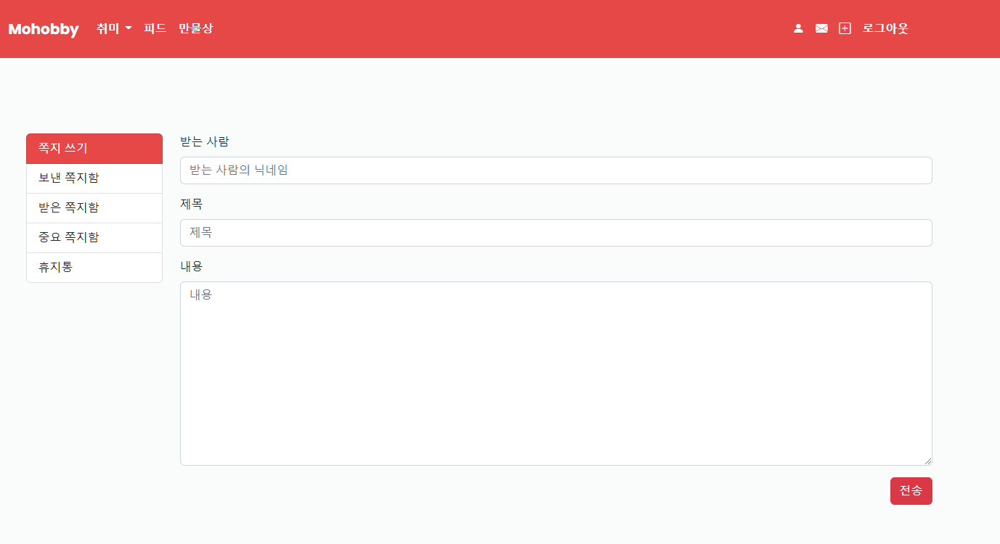
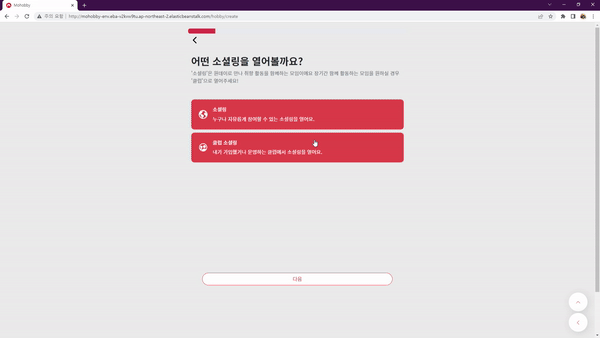
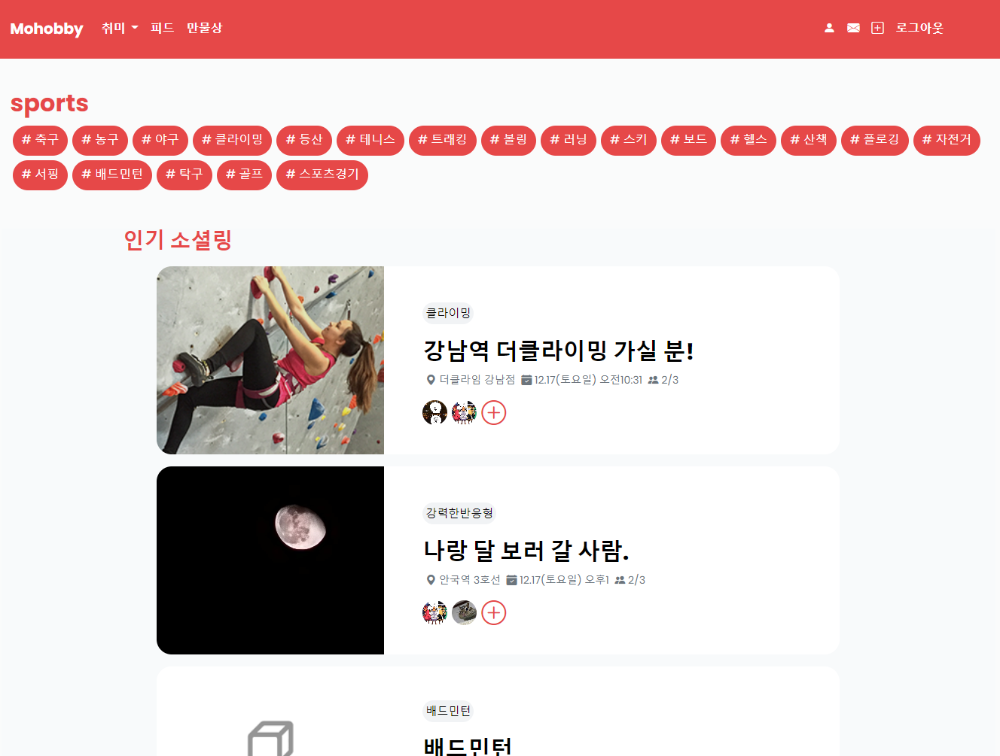
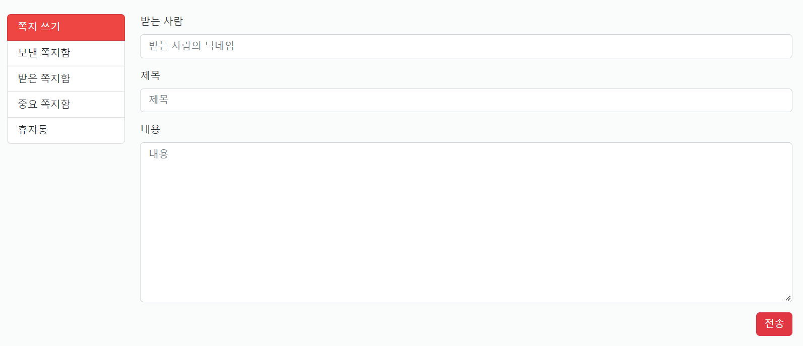
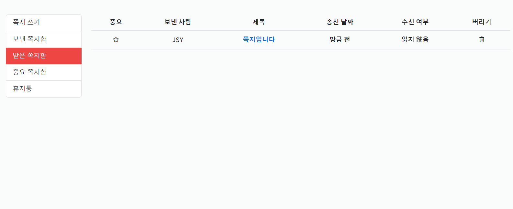
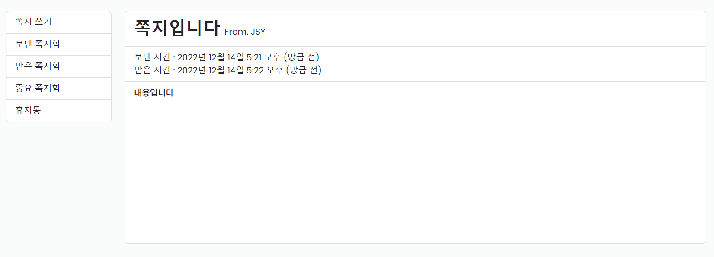

# Mohobby (男남자의 자격)

깃허브 저장소 주소 1: https://github.com/midhyun/Mohobby
서비스 주소: http://mohobby-env.eba-v2kvw9tu.ap-northeast-2.elasticbeanstalk.com/
팀 문서 주소: https://www.notion.so/hg-edu/14-a81608bcb8304bbe896bb943cd9e9ef7

# 😁**프로젝트 소개**

남자라면, 사람이라면 누구나 눈치 보지 않고 즐길 수 있는 건전한 취미가 필요하다.

취미의 A to Z 놀면 **Mohobby**??

만인의 취미 **만취**! 이곳에서 당신의 취미를 함께하라.

# 😀프로젝트 화면

- Accounts
    - 회원가입, 카카오 로그인
        - 필수정보를 입력해야만 가입가능
        - 멀티스텝 폼
        - recaptcha - ‘로봇이 아닙니다’ 체크해야만 가입 가능
    - 디테일 페이지
        - 유저가 작성한 글들을 카테고리별로 확인
        - 선택한 취미를 클릭하여 해당하는 소셜링을 찾아볼 수 있음
        - 팔로잉, 팔로워, 차단목록과 메시지까지 유저 관계를 한눈에 확인할 수 있음
    - 메시지 기능
        - 쪽지
    
    
    
    
    
    
    
- Hobby
    - 소셜링 만들기
        - 멀티스텝 폼, 필수사항 입력해야만 작성 가능
        - 원하는 태그가 없을시 직접입력 가능
        - 장소는 온라인, 오프라인 설정 가능(오프라인 설정시 장소 입력 가능)
        - 인원은 최소(3명에서 15명 가능)
        - 비용 설정가능
    - 소셜링 디테일 페이지
        - 호스트 정보로 이동 쪽지 보내기 가능
        - 참여 신청후 호스트 승인 대기, 승인 완료 인물 나눠서 등록
        - 댓글 대댓글 각각 좋아요 기능 추가
    
    
    
    
    
    
    
- Community
    - 소셜링 후기 등 유저간 커뮤니케이션
    
    
    
- Products
    - 모든 취미관련 물품 거래를 위한 만물상
        - 거래글을 작성하면 유저간 거래가 가능함
    - 중고거래 CREATE, UPDATE
        - 제목 (CharField)
        - 판매 가격 (BigIntegerField)
        - 상품 상태 (사용감 있음, 거의 새 것, 미개봉 중 하나 선택)
        - 배송 방법 (직거래, 택배거래 중복 선택 가능)
        - 거래 위치 (다음 주소 API 적용, 시도와 시군구 정보를 가져옴)
        - 이미지 (ProcessedImageField)
        - 내용 (django-summernote 텍스트 에디터 적용)
    - 중고거래 READ, DELETE
        - 글 목록 페이지에 card hover 효과, 페이지네이션 , 검색 기능 적용
        - 글 작성 시 업로드 했던 이미지 표시
        - 글 제목, 상품 상태, 배송 방법, 거래 위치 표시
        - 가격 표시 (humanize intcomma 태그로 3자리마다 콤마를 찍어서 표현)
        - 조회수 표시 (쿠키를 사용해서 하루에 한 번씩 조회수 증가)
        - 좋아요(찜) 기능 (찜 횟수 표시, 비동기 처리)
        - 쪽지 보내기 기능 (글 작성자의 닉네임으로 쪽지를 보냄)
        - 본인의 게시글일 경우 우측 드롭다운 버튼으로 수정, 삭제 가능
        - summernote로 작성한 내용을 safe 태그로 표시
        - 댓글, 대댓글, 댓글 좋아요 기능 (비동기 처리)
    
    
    
    
    

- Notes
    - 쪽지 CREATE
        - 받는 쪽지, 보낸 쪽지 2개의 모델 생성 후 OneToOneField로 일대일 대응
        - 받는 사람의 닉네임 (CharField)
        - 제목 (CharField)
        - 내용 (TextField)
    - 쪽지 READ, DELETE
        - 보낸 쪽지함에서 본인이 송신한 쪽지 목록 확인 가능
        - 보낸 쪽지함에서 본인이 보낸 쪽지를 삭제 가능 (상대방이 받은 쪽지 정보는 삭제되지 않음)
        - 받은 쪽지함에서 본인이 수신한 쪽지 목록 확인 가능
        - 받았지만 읽지 않은 쪽지를 확인하면 수신 여부가 업데이트됨 (쪽지 송신자가 수신 여부를 확인 가능)
        - 받은 쪽지함에서 쪽지를 중요 쪽지함 또는 휴지통으로 이동 가능
        - 중요 쪽지함에서는 쪽지 삭제가 불가능
        - 휴지통에서는 쪽지를 다시 되돌리거나 삭제할 수 있음 (상대방이 보냈던 쪽지 정보는 삭제되지 않음)
        - 쪽지에는 보낸 사람의 닉네임, 받은 사람의 닉네임, 제목, 내용, 송신 날짜, 수신 여부 정보가 있음
    
    
    
    
    
    
    

