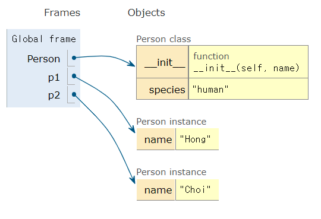

# 클래스

- 클래스 속성(attribute)

  - 한 클래스의 모든 인스턴스라도 똑같은 값을 가지고 있는 속성
  - 클래스 선언 내부에서 정의
  - `<classname>.<name>`으로 접근 및 할당

  ```python
  class Circle :
      pi = 3.14 # 클래스 변수 정의
  
  c1 = Circle()
  c2 = Circle()
  
  print(Circle.pi)
  print(c1.pi)
  print(c2.pi)
  # 3.14
  # 3.14
  # 3.14
  ```

- 인스턴스와 클래스 간의 이름 공간(namespace)

  - 클래스를 정의하면, 클래스에 해당하는 이름 공간이 생성됨
  - 인스턴스를 만들면, 인스턴스 객체가 생성되고 이름 공간 생성
  - 인스턴스에서 특정 속성에 접근하면, 인스턴스 -> 클래스 순으로 탐색

  ```python
  class Person :
      species = 'human'
      
      def __init__(self, name) :
          self.name = name
          
  p1 = Person('Hong')
  p2 = Person('Choi')
  ```

  |  |
  | :----------------------------------------------------------: |
  | Person class : 클래스 이름 공간<br/>Person instance : 인스턴스별 이름 공간 |

  ```python
  class Person :
      name = 'unknown'
      
      def talk(self) :
          print(self.name)
          
  p2 = Person()
  p2.talk()
  p2.name = 'Kim'
  p2.talk()
  # unknown
  # Kim
  ```
  
  |  |
  | :----------------------------------------------------------: |
  |    인스턴스 이름 공간에 name이 없어 클래스 이름 공간 탐색    |
  
  |  |
  | :----------------------------------------------------------: |
  |             Person instance : 인스턴스 이름 공간             |
  
- 클래스 메소드

  - 클래스가 사용할 메소드
  - `@classmethod` 데코레이터를 사용하여 정의
    - 데코레이터 : 함수를 어떤 함수로 꾸며서 새로운 기능을 부여
  - 호출 시, 첫 번째 인자로 클래스(cls)가 전달됨

  ```python
  class MyClass :
      
      @classmethod
      def class_method(cls, arg1, ...) :
  ```

  ```python
  MyClass.class_method(...)
  ```

- static 메소드

  - 인스턴스 변수, 클래스 변수를 전혀 다루지 않는 메소드
  - 속성을 다루지 않고 단지 기능(행동)만을 하는 메소드를 정의할 때 사용
  - `@staticmethod` 데코레이터를 사용하여 정의
  - 호출 시, **어떠한 인자도 전달되지 않음** (클래스 정보에 접근/수정 불가능)

  ```python
  class MyClass :
      
      @staticmethod
      def static_method(arg1, ...) :
  ```

  ```python
  MyClass.static_method(...)
  ```

-  요약

  - 클래스 구현
    - 클래스 정의
    - 데이터 속성 정의 (객체의 정보는 무엇인지)
    - 메소드 정의 (객체를 어떻게 사용할 것인지)
  - 클래스 활용
    - 해당 객체 타입의 인스턴스 생성 및 조작

- 메소드 정리

  - 인스턴스 메소드
    - 호출한 인스턴스를 의미하는  self 매개변수를 통해 인스턴스를 조작
  - 클래스 메소드
    - 클래스를 의미하는 cls 매개변수를 통해 클래스를 조작
  - 스태틱 메소드
    - 인스턴스나 클래스를 의미하는 매개변수를 사용하지 않음
      - 즉, 객체 상태나 클래스 상태를 수정할 수 없음
    - 일반 함수처럼 동작하지만 클래스의 이름 공간에 귀속됨
      - 주로 해당 클래스로 한정하는 용도로 사용
  - 클래스 메소드와 스태틱 메소드는 상속을 했을 때 차이가 두드러짐

  ```python
  class MyClass :
      def method(self) :
          return 'instance method', self
  
      @classmethod
      def classmethod(cls) :
          return 'class method', cls
      
      @staticmethod
      def staticmethod() :
          return 'static method'
  ```

# 객체지향의 핵심 개념

- 추상화
- 상속
- 다형성
- 캡슐화

## 추상화

```python
# 학생(Student)을 표현하기 위한 클래스를 생성
class Student :
    def __init__(self, name, age, gpa) :
        self.name = name
        self.age = age
        self.gpa = gpa
    
    def talk(self) :
        print(f'반갑습니다. {self.name}입니다.')
        
    def study(self) :
        self.gpa += 0.1
```

```python
# 교수(Professor)를 표현하기 위한 클래스를 생성
class Professor :
    def __init__(self, name, age, department) :
        self.name = name
        self.age = age
        self.department = department
    
    def talk(self) :
        print(f'반갑습니다. {self.name}입니다.')
        
    def teach(self) :
        self.age += 0.1
```

```python
class Person :
    def __init__(self, name, age) :
        self.name = name
        self.age = age

    def talk(self) :
        print(f'반갑습니다. {self.name}입니다.')
```

## 상속

```python
class ChildClass(ParentClass) :
    pass
```

- 두 클래스 사이 부모 - 자식 관계를 정립하는 것

- 클래스는 상속이 가능함 (모든 파이썬 클래스는 object를 상속 받음)

- 자식 클래스는 부모 클래스에 정의된 속성, 행동, 관계 및 제약 조건을 모두 상속 받음

- 부모 클래스의 속성, 메소드가 자식 클래스에 상속되므로, 코드의 재사용성이 높아짐

- 상속을 통한 메소드 재사용

  ```python
  class Person :
      def __init__(self, name, age) :
          self.name = name
          self.age = age
  
      def talk(self) :
          print(f'반갑습니다. {self.name}입니다.')
          
  class Professor(Person) :
      def __init__(self, name, age, department) :
          self.name = name
          self.age = age
          self.department = department
          
  class Student(Person) :
      def __init__(self, name, age, gpa) :
          self.name = name
          self.age = age
          self.gpa = gpa
          
  p1 = Professor('박교수', 49, '컴퓨터공학과')
  s1 = Student('김학생', 20, 3.5)
  p1.talk() # 부모 Person 클래스의 talk 메소드를 활용
  # 반갑습니다. 박교수입니다.
  s1.talk() # 부모 Person 클래스의 talk 메소드를 활용
  # 반갑습니다. 김학생입니다.
  ```

- 상속 관련 함수와 메소드

  - `isinstance(object, classinfo)` : object가 classinfo의 instance거나 subclass(자식 클래스)인 경우 True

    ```python
    # 상속 없는 경우
    class Person :
        pass
    
    class Professor :
        pass
    
    class Student :
        pass
    
    p1 = Professor()
    s1 = Student()
    
    print(isinstance(p1, Person))    # False
    print(isinstance(p1, Professor)) # True
    print(isinstance(p1, Student))   # False
    print(isinstance(s1, Person))    # False
    print(isinstance(s1, Professor)) # False
    print(isinstance(s1, Student))   # True
    ```

    ```python
    # 상속인 경우
    class Person :
        pass
    
    class Professor(Person) :
        pass
    
    class Student(Person) :
        pass
    
    p1 = Professor()
    s1 = Student()
    
    print(isinstance(p1, Person))    # True
    print(isinstance(p1, Professor)) # True
    print(isinstance(p1, Student))   # False
    print(isinstance(s1, Person))    # True
    print(isinstance(s1, Professor)) # False
    print(isinstance(s1, Student))   # True
    ```

  - `issubclass(class, classinfo)`

    - class가 classinfo의 subclass인 경우 True
    - classinfo는 클래스 객체의 튜플일 수 있으며, classinfo의 모든 항목을 검사

    ```python
    issubclass(bool, int)                    # True
    issubclass(float, int)                   # False
    issubclass(Professor, Person)            # True
    issubclass(Professor, (Person, Student)) # True
    ```

  - `super()` : 자식 클래스에서 부모 클래스를 사용하고 싶은 경우

    ```python
    class Person :
        def __init__(self, name, age, number, email) :
            self.name = name
            self.age = age
            self.number = number
            self.email = email
            
    class Student(Person) :
        def __init__(self, name, age, number, email, student_id) :
            # Person 클래스
            super().__init__(name, age, number, email)
            self.student_id = student_id
    ```

- 상속 정리

  - 파이썬의 모든 클래스는 object로부터 상속됨
  - 부모 클래스의 모든 요소(속성, 메소드)가 상속됨
  - super()를 통해 부모 클래스의 요소를 호출할 수 있음
  - 메소드 오버라이딩을 통해 자식 클래스에서 재정의 가능함
  - 상속 괸계에서의 이름 공간은 인스턴스 -> 자식 클래스 -> 부모 클래스 순으로 탐색

- 다중 상속

  - 두 개 이상의 클래스를 상속 받는 경우
  - 상속 받은 모든 클래스의 요소를 활용 가능함
  - 중복된 속성이나 메소드가 있는 경우 상속 순서에 의해 결정됨

  ```python
  class Person :
      pass
  
  class Professor(Person) :
      pass
  
  class Student(Person, Professor) :
      pass
  ```

## 다형성

- 동일한 메소드가 클래스에 따라 다르게 행동할 수 있음을 의미

- 서로 다른 클래스에 속해있는 객체들이 동일한 메시지에 대해 다른 방식으로 응답될 수 있음

- 메소드 오버라이딩

  - 상속 받은 메소드를 재정의
  - 클래스 상속 시, 부모 클래스에서 정의한 메소드를 자식 클래스에서 변경
  - 부모 클래스의 메소드 이름과 기본 기능은 그대로 사용하지만, 특정 기능을 바꾸고 싶을 때 사용

  ```python
  class Person :
      def __init__(self, name) :
          self.name = name
          
      def talk(self) :
          print(f'반갑습니다. {self.name}입니다.')
  
  class Professor(Person) :
      def talk(self) :
          print(f'{self.name}일세.')
  
  class Student(Person, Professor) :
      def talk(self) :
          super().talk()
          print(f'저는 학생입니다.')
          
  p1 = Professor('김교수')
  p1.talk()
  # 김교수일세.
  
  s1 = Student('이학생')
  s1 = talk()
  # 반갑습니다. 이학생입니다.
  # 저는 학생입니다.
  ```

## 캡슐화

- 객체의 일부 구현 내용에 대해 외부로부터의 직접적인 접근을 차단
- 파이썬에서 기능상으로 존재하지는 않지만, 관용적으로 사용되는 표현이 있음
- 접근제어자 종류
  - Public Access Modifier
    - 언더바 없이 시작하는 메소드나 속성
    - 어디서나 호출이 가능, 하위 클래스 override 허용
  - Protected Access Modifier
    - **언더바 1개**로 시작하는 메소드나 속성
    - 암묵적 규칙에 의해 부모 클래스 내부와 자식 클래스에서만 호출 가능
  - Private Access Modifier
    - **언더바 2개**로 시작하는 메소드나 속성
    - 본 클래스 내부에서만 사용이 가능