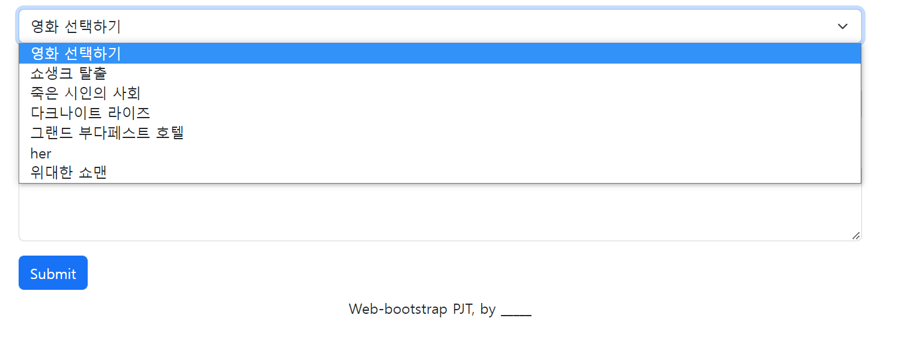
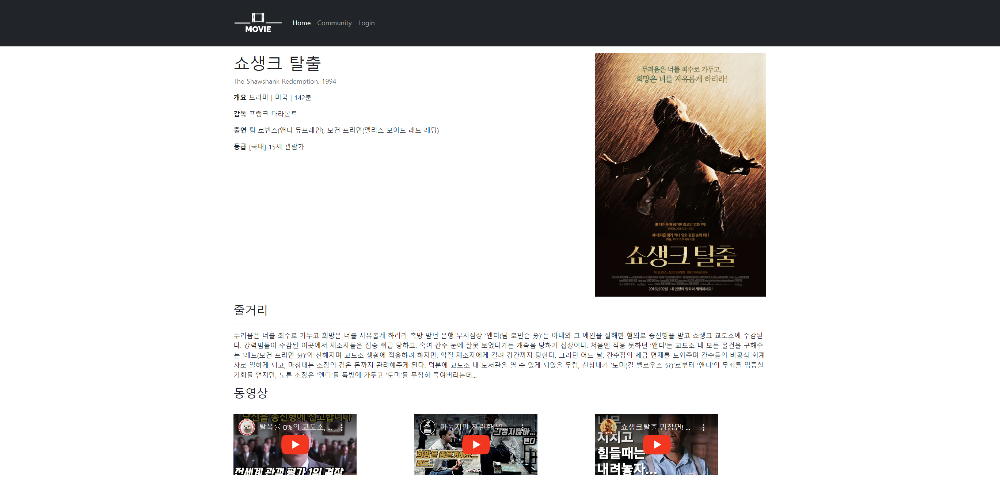
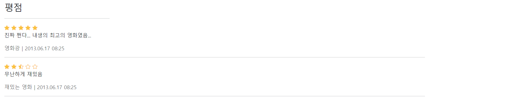

# 웹 03

날짜: 2022년 9월 14일

> 💡 오늘은 다양한 사이트를 직접 경험해보고 직접 레이아웃을 설계하여 필요한 페이지를 제작합니다.

## 목표

- HTML를 통한 웹 페이지 마크업
- CSS를 통한 선택자 활용 및 속성 부여
- 시맨틱 태그를 활용한 기본 레이아웃 구성
- 영화 추천 사이트 메인 레이아웃 구성

## 준비 사항

1. **(필수)** HTML/CSS 환경 구성
2. **(필수)** Bootstrap

## 요구 사항

### 04_form.html

- `03_community.html` 에서 글 작성하기 버튼을 적절한 위치에 만들고 누르면 해당 페이지로 이동합니다.
- 리뷰 작성을 위한 페이지를 자유롭게 설계하여 제작합니다.
- 예시
  
    
    
    
    

### 05_movie.html

- `02_home.html` 에서 쇼생크 탈출 카드를 누르면 해당 페이지로 이동합니다.
- 영화 상세 페이지를 자유롭게 설계하여 제작합니다.
- 참고
    - [https://movie.daum.net/moviedb/main?movieId=1368](https://movie.daum.net/moviedb/main?movieId=1368)
    - [https://movie.naver.com/movie/bi/mi/basic.naver?code=17421](https://movie.naver.com/movie/bi/mi/basic.naver?code=17421)
    - [https://www.themoviedb.org/movie/278-the-shawshank-redemption?language=ko](https://www.themoviedb.org/movie/278-the-shawshank-redemption?language=ko)
    - [https://www.wavve.com/player/movie?movieid=MV_CD01_WR0000011371](https://www.wavve.com/player/movie?movieid=MV_CD01_WR0000011371)
    - [https://watcha.com/ko-KR/contents/mNdKBkO](https://watcha.com/ko-KR/contents/mNdKBkO)
- 예시
  
    
    
    
    

### 사이트 추가 설정

- 웹 폰트를 적용 해봅니다.
- favicon을 적용 해봅니다.
- 완성된 페이지를 GitHub Pages를 통해 배포합니다.
    - GitHub Pages를 추가 활용하기 위해서 두가지 방법이 있습니다.
        - **필수: `02_home.html`을 `index.html`으로 변경할 것**
        1. 조직(Organization) 생성하기
            1. 예) fakewatcha 조직 생성 후 [fakewatcha.github.io](http://fakewatcha.github.io) 저장소를 만들어서 활용
        2. 별도의 저장소를 생성하기
            1. Settings > Pages 설정 가능한 옵션이 있습니다. 
- README에 개인 후기를 작성합니다.

> 💡 2일간 작성한 코드 및 README 파일을 포함하여 Syllaverse 제출합니다.
GitHub Pages URL을 디스코드에 공유 해주세요 🙂

### (개인 또는 팀) 자유 실습

- 위의 영화 사이트들을 참고하여 영화 목록 혹은 상세 페이지 등을 자유롭게 꾸며봅니다.