# WEB

## CSS Position

- 문서 상에서 요소의 위치를 지정
- static : 모든 태그의 기본 값 (기준 위치)
  - 일반적인 요소의 배치 순서에 따름 (좌측 상단)
  - 부모 요소 내에서 배치될 때는 부모 요소의 위치를 기준으로 배치 됨
- 아래는 좌표 프로퍼티(top, bottom, left, right)를 사용하여 이동 가능
  - relative : 상대 위치
    - 자기 자신의 static 위치를 기준으로 이동 (normal flow 유지)
    - 레이아웃에서 요소가 차지하는 공간은 static일 때와 같음 (normal position 대비 offset)
  - absolute : 절대 위치
    - 요소를 일반적인 문서 흐름에서 제거 후 레이아웃에 공간을 차지하지 않음 (normal flow에서 벗어남)
    - static이 아닌 가장 가까이 있는 부모/조상 요소를 기준으로 이동 (없는 경우 브라우저 화면 기준으로 이동)
  - fixed : 고정 위치
    - 요소를 일반적인 문서 흐름에서 제거 후 레이아웃에 공간을 차지하지 않음 (normal flow에서 벗어남)
    - 부모 요소에 관계없이 viewport를 기준으로 이동, 스크롤 시에도 항상 같은 곳에 위치함
  - sticky : 스크롤에 따라 static -> fixed로 변경
    - 속성을 적용한 박스는 평소에 문서 안에서 position: static 상태와 같이 일반적인 흐름에 따르지만, 스크롤 위치가 임계점에 이르면 position: fixed와 같이 박스를 화면에 고정할 수 있는 속성
    - 일반적으로 Navigation Bar에서 사용됨

### static

| 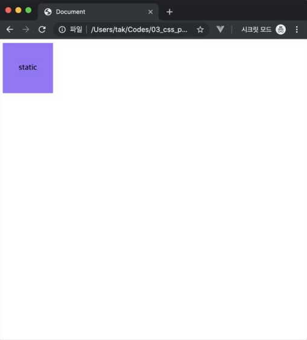 | 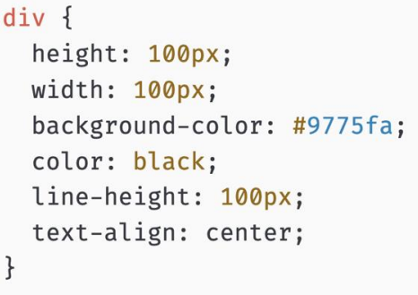 |
| ----------------------------- | ----------------------------- |

### relative

| 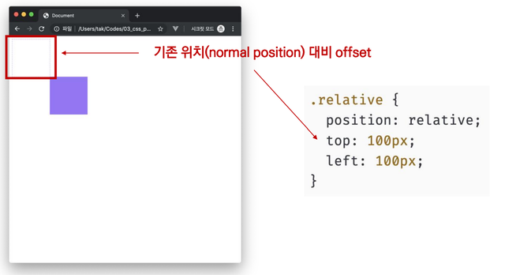 |
| :---------------------------: |

### absolute

| 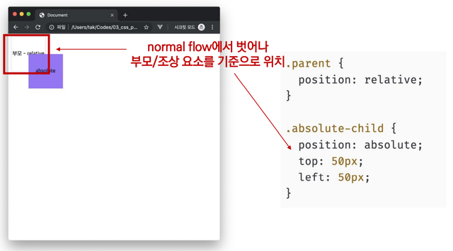 |
| :---------------------------: |

#### absolute 사용 예시

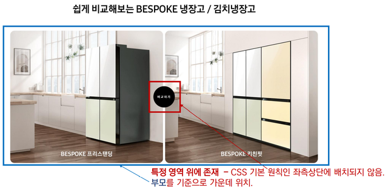

### fixed

| 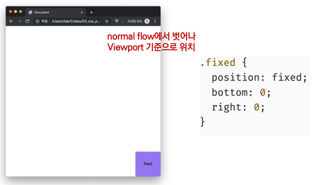 |
| :---------------------------: |

#### fixed 사용 예시

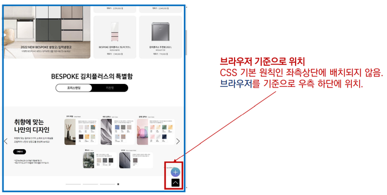

### absolute vs relative

- 형에게 top: 100px;을 적용했을 때 absolute와 relative의 차이는?

| 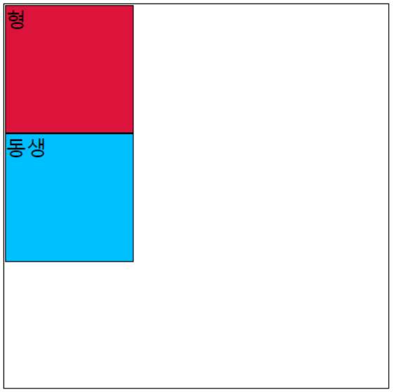 | 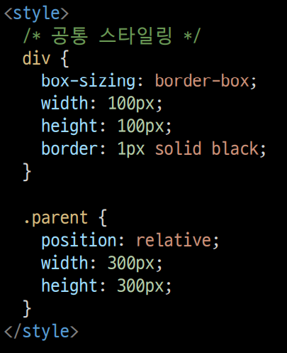 |
| ----------------------------- | ----------------------------- |

| 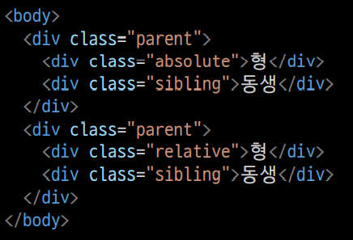 | 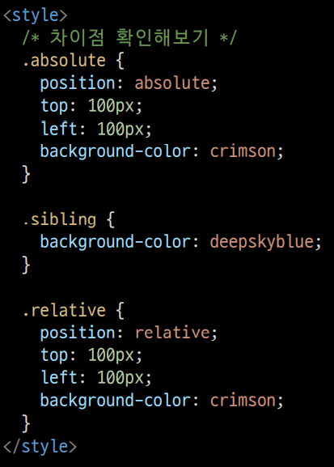 |
| ----------------------------- | ----------------------------- |

| 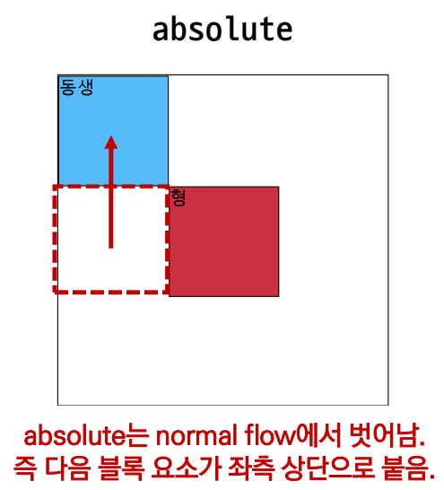 | 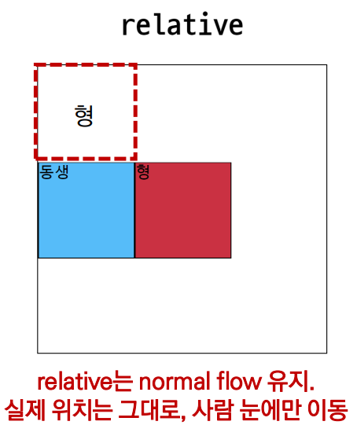 |
| ----------------------------- | ----------------------------- |

## CSS 원칙

- CSS 원칙 I, II : Normal flow
  - 모든 요소는 네모(박스 모델), 좌측 상단에 배치
  - display에 따라 크기와 배치가 달라짐
- CSS 원칙 III : **position으로 위치의 기준을 변경**
  - relative : 본인의 원래 위치
  - absolute : 특정 부모의 위치
  - fixed : 화면의 위치
  - sticky: 기본적으로 static이나 스크롤 이동에 따라 fixed로 변경

## CSS Layout

- CSS layout techniques
  - Display
  - Position
  - Float (CSS1, 1996)
  - Flexbox (2012)
  - Grid (2017)
  - 기타 : Responsive Web Design(2010), Media Queries (2012)

### Float

| 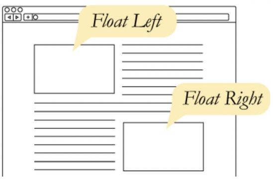 | 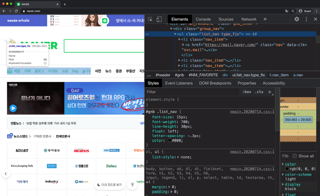 |
| ----------------------------- | ----------------------------- |

- 박스를 왼쪽 혹은 오른쪽으로 이동시켜 텍스트를 포함 인라인요소들이 주변을 wrapping 하도록 함
- 요소가 Normal flow를 벗어나도록 함

| 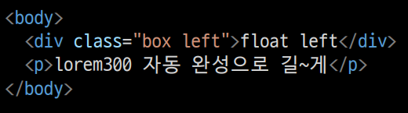 | 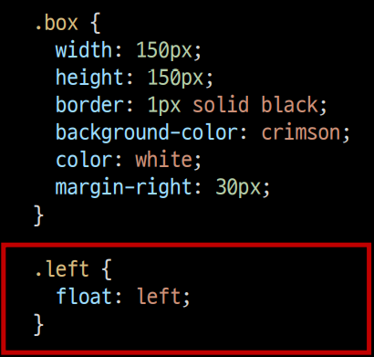 |
| ----------------------------- | ----------------------------- |

| 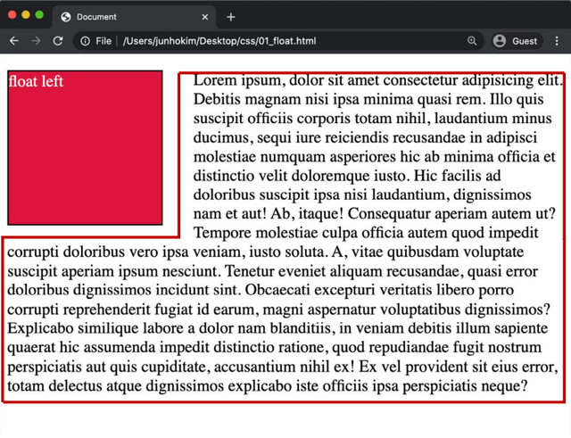 |
| :---------------------------: |

### Flexbox

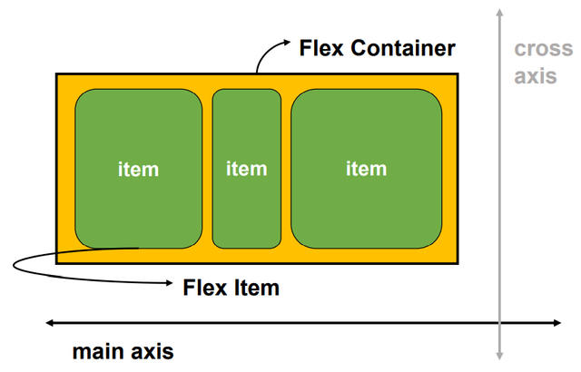

- 행과 열 형태로 아이템들을 배치하는 레이아웃 모델

- 축

  - main axis (메인 축)
  - cross axis (교차 축)

- flex-direction : row 

  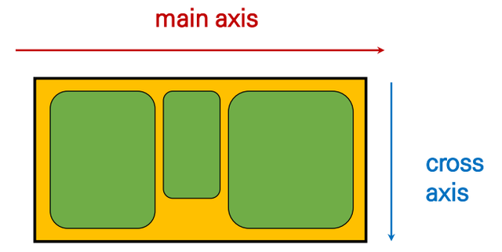

- 구성 요소

  - Flex Container (부모 요소)

    - flexbox 레이아웃을 형성하는 가장 기본적인 모델

    - Flex Item들이 놓여있는 영역

    - display 속성을 flex 혹은 inline-flex로 지정

      ```css
      /* flexbox 시작 */
      .flex-container {
        display: flex;
      }
      /* 부모 요소에 display: flex 혹은 inline-flex */
      ```

  - Flex Item (자식 요소)

    - 컨테이너에 속해 있는 컨텐츠(박스)

#### Flexbox를 쓰는 이유

- 이전까지 Normal Flow를 벗어나는 수단은 Float 혹은 Position 
- Float 혹은 Position으로 하기 어려웠던 것 (수동 값 부여 없이)
  - 수직 정렬
  - 아이템의 너비와 높이 혹은 간격을 동일하게 배치

#### Flex 속성

- 배치 설정
  - flex-direction
  - flex-wrap
- 공간 나누기
  -  justify-content (main axis)
  - align-content (cross axis)
- 정렬
  - align-items (모든 아이템을 cross axis 기준으로)
  - align-self (개별 아이템)

##### Flex 속성 : flex-direction

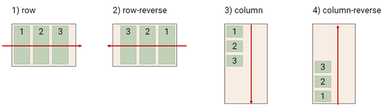

- Main axis 기준 방향 설정
- 역방향의 경우 HTML 태그 선언 순서와 시각적으로 다르니 유의 (웹 접근성에 영향)

##### Flex 속성 : flex-wrap

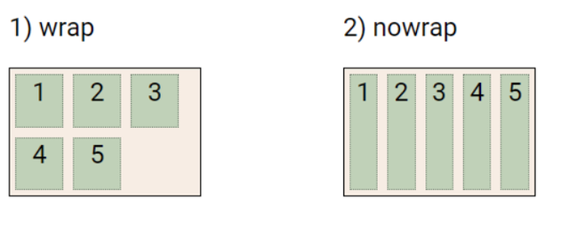

- 아이템이 컨테이너를 벗어나는 경우 해당 영역 내에 배치되도록 설정
- 즉, 기본적으로 컨테이너 영역을 벗어나지 않도록 함

##### Flex 속성 : flex-direction & flex-wrap

- flex-direction : Main axis의 방향을 설정
- flex-wrap : 요소들이 강제로 한 줄에 배치 되게 할 것인지 여부 설정
  - nowrap (기본값) : 한 줄에 배치
  - wrap : 넘치면 그 다음 줄로 배치
- flex-flow
  - flex-direction과 flex-wrap 의 shorthand
  - flex-direction과 flex-wrap에 대한 설정 값을 차례로 작성
  - 예시) flex-flow: row nowrap;

##### Flex 속성 : justify-content

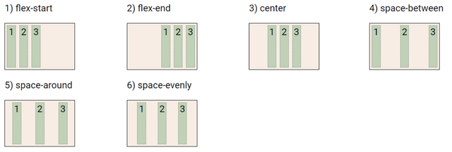

- Main axis를 기준으로 공간 배분

##### Flex 속성 : align-content

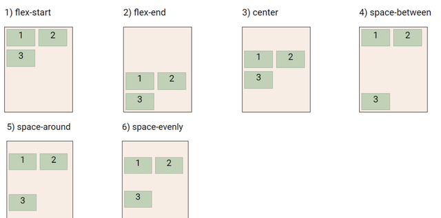

- Cross axis를 기준으로 공간 배분 (아이템이 한 줄로 배치되는 경우 확인할 수 없음)

##### Flex 속성 : justify-content & align-content

- 공간 배분
  - flex-start (기본 값) : 아이템들을 axis 시작점으로
  - flex-end : 아이템들을 axis 끝 쪽으로
  - center : 아이템들을 axis 중앙으로
  - space-between : 아이템 사이의 간격을 균일하게 분배
  - space-around : 아이템을 둘러싼 영역을 균일하게 분배 (가질 수 있는 영역을 반으로 나눠서 양쪽에)
  - space-evenly : 전체 영역에서 아이템 간 간격을 균일하게 분배

##### Flex 속성 : align-items

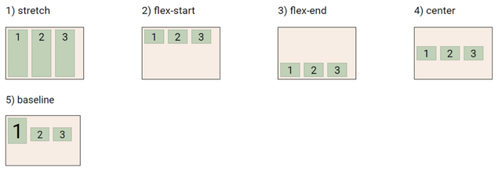

- 모든 아이템을 Cross axis를 기준으로 정렬

##### Flex 속성 : align-self

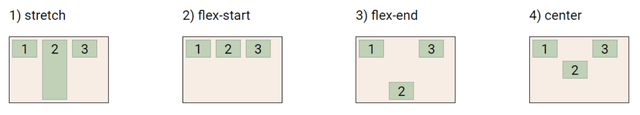

- 개별 아이템을 Cross axis 기준으로 정렬
  - **주의! 해당 속성은 컨테이너에 적용하는 것이 아니라 개별 아이템에 적용**

##### Flex 속성 : align-items & align-self

- Cross axis를 중심으로
  - stretch (기본 값) : 컨테이너를 가득 채움
  - flex-start : 위
  - flex-end : 아래
  - center : 가운데
  - baseline : 텍스트 baseline에 기준선을 맞춤

##### Flex 기타 속성

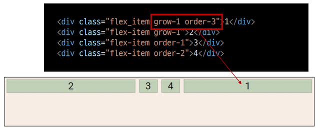

- flex-grow : 남은 영역을 아이템에 분배
- order : 배치 순서

#### Flexbox 활용 레이아웃

- 수직 수평 가운데 정렬

  | 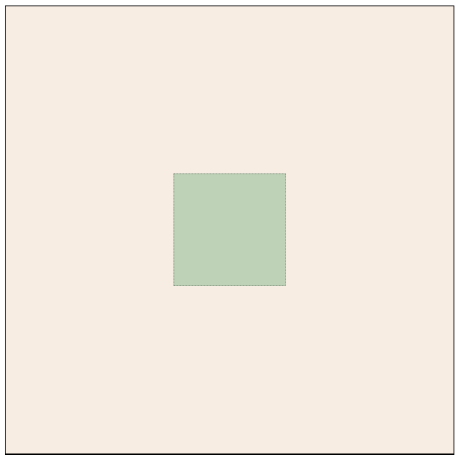 | 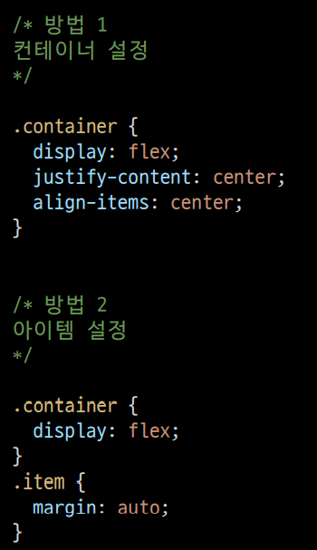 |
  | ----------------------------- | ----------------------------- |

- 카드 배치

  | 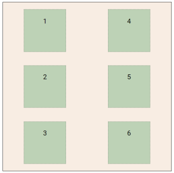 | 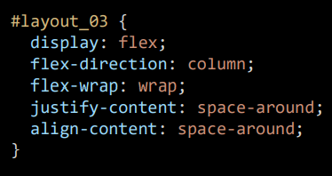 |
  | ----------------------------- | ----------------------------- |

  | 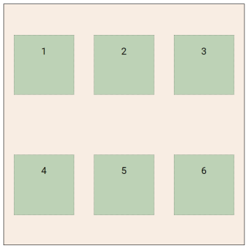 | 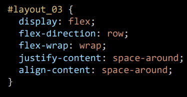 |
  | ----------------------------- | ----------------------------- |

## 참고용 문서

- Learn CSS : [https://web.dev/learn/css](https://web.dev/learn/css)
- MDN
  - [https://developer.mozilla.org/ko/docs/Web/CSS/CSS_Flexible_Box_Layout/Basic_Concepts_of_Flexbox](https://developer.mozilla.org/ko/docs/Web/CSS/CSS_Flexible_Box_Layout/Basic_Concepts_of_Flexbox)
  - [https://developer.mozilla.org/ko/docs/Learn/CSS/CSS_layout/Flexbox#왜_flexbox인가](https://developer.mozilla.org/ko/docs/Learn/CSS/CSS_layout/Flexbox#왜_flexbox인가)
- Flex Floggy : [https://flexboxfroggy.com/#ko](https://flexboxfroggy.com/#ko)
- [https://flukeout.github.io/](https://flukeout.github.io/)
- [https://ko.learnlayout.com/](https://ko.learnlayout.com/)