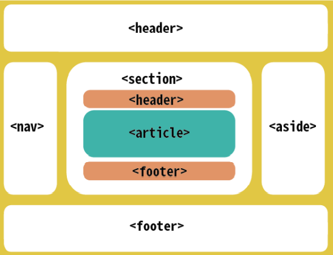
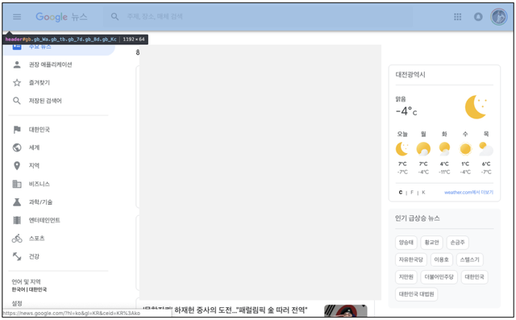
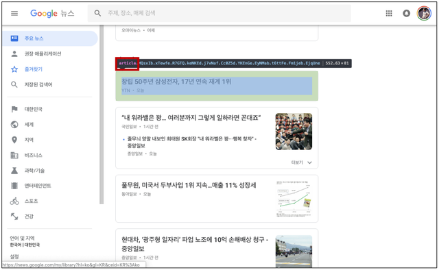
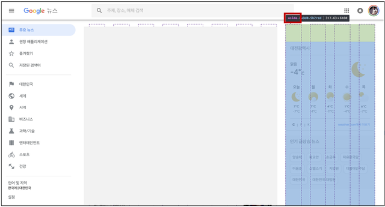
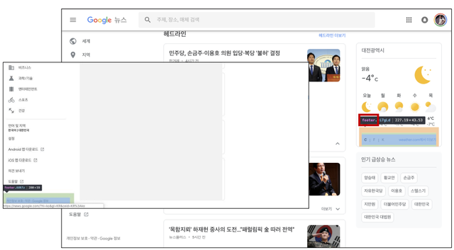

# WEB

## 시맨틱 태그



- HTML 태그가 특정 목적, 역할 및 의미적 가치(semantic value)를 가지는 것

  - 예를 들면 h1 태그는 "이 페이지에서 최상위 제목"인 텍스트를 감싸는 역할(또는 의미)을 나타냄

- Non semantic 요소로는 `div`, `span` 등이 있고 `a`, `form`, `table` 태그들은 semantic 요소로 볼 수 있음

- 대표적인 시맨틱 태그 목록

  - header : 문서 전체나 섹션의 헤더(머리말 부분)

  - nav : 내비게이션

  - aside : 사이드에 위치한 공간, 메인 콘텐츠와 관련성이 적은 콘텐츠

  - section : 문서의 일반적인 구분, 컨텐츠의 그룹을 표현

  - article : 문서, 페이지, 사이트 안에서 독립적으로 구분되는 영역

  - footer : 문서 전체나 섹션의 푸터(마지막 부분)

- 시맨틱 태그를 사용하면 각 요소의 의미를 명확히 알 수 있음

  ```html
  <!-- Non semantic -->
  <div>
    <div></div>
  </div>
  <div>
    <div></div>
    <div></div>
  </div>
  <div></div>
  ```

  ```html
  <!-- Semantic -->
  <header>
    <nav></nav>
  </header>
  <section>
    <article></article>
    <article></article>
  </section>
  <footer></footer>

- 시맨틱 태그 사용 예시 : 구글 뉴스
  - `<header>`
  
  - `<article>`
  
  - `<aside>`
  
  - `<footer>`
  

  
  
### 왜 시맨틱 태그를 사용해야 하는가?
- 의미론적 마크업 

  - 개발자 및 사용자 뿐만 아니라 검색엔진 등에 의미 있는 정보의 그룹을 태그로 표현

  - 단순히 구역을 나누는 것 뿐만 아니라 ‘의미’를 가지는 태그들을 활용하기 위한 노력

  - 요소의 의미가 명확해지기 때문에 코드의 가독성을 높이고 유지보수를 쉽게 함

  - 검색 엔진 최적화(SEO)를 위해서 메타 태그, 시맨틱 태그 등을 통한 마크업을 효과적으로 활용해야 함

## 참고용 문서

- [https://9elements.com/bem-cheat-sheet/#navigation](https://9elements.com/bem-cheat-sheet/#navigation)