# Web

## Bootstrap

### Layout

#### Grid

|  |  |
| :-----------------------------: | :-----------------------------: |

- 요소들의 디자인과 배치에 도움을 주는 시스템

- 기본 요소

  - Column : 실제 컨텐츠를 포함하는 부분 
  - Gutter : Column과 Column 사이의 공간 (사이 간격)
  - Container : Column들을 담고 있는 공간

- Bootstrap Grid system은 Flexbox로 제작됨

- container, rows, column으로 컨텐츠를 배치하고 정렬

  ```html
  <div class="container">
    <div class="row">
      <div class="col">...</div>
      <div class="col">...</div>
      <div class="col">...</div>
    </div>
  </div>
  ```

- 반드시 기억해야 할 2가지

  - column은 기본 12개
  - 6개의 grid breakpoints (`xs(none)`, `sm`, `md`, `lg`, `xl`, `xxl`)

|                       | xs < 576px                                                   | sm ≥ 576px                                                   | md ≥ 768px                                                   | lg ≥ 992px                                                   | xl ≥ 1200px                                                  | xxl ≥ 1400px                                                 |
| --------------------- | ------------------------------------------------------------ | ------------------------------------------------------------ | ------------------------------------------------------------ | ------------------------------------------------------------ | ------------------------------------------------------------ | ------------------------------------------------------------ |
| Container `max-width` | None (auto)                                                  | 540px                                                        | 720px                                                        | 960px                                                        | 1140px                                                       | 1320px                                                       |
| Class prefix          | `.col-`                                                      | `.col-sm-`                                                   | `.col-md-`                                                   | `.col-lg-`                                                   | `.col-xl-`                                                   | `.col-xxl-`                                                  |
| # of columns          | 12                                                           | 12                                                           | 12                                                           | 12                                                           | 12                                                           | 12                                                           |
| Gutter width          | 1.5rem<br/>(0.75rem on left and right)                       | 1.5rem<br/>(0.75rem on left and right)                       | 1.5rem<br/>(0.75rem on left and right)                       | 1.5rem<br/>(0.75rem on left and right)                       | 1.5rem<br/>(0.75rem on left and right)                       | 1.5rem<br/>(0.75rem on left and right)                       |
| Custom gutters        | [Yes](https://getbootstrap.com/docs/5.2/layout/gutters/)     | [Yes](https://getbootstrap.com/docs/5.2/layout/gutters/)     | [Yes](https://getbootstrap.com/docs/5.2/layout/gutters/)     | [Yes](https://getbootstrap.com/docs/5.2/layout/gutters/)     | [Yes](https://getbootstrap.com/docs/5.2/layout/gutters/)     | [Yes](https://getbootstrap.com/docs/5.2/layout/gutters/)     |
| Nestable              | [Yes](https://getbootstrap.com/docs/5.2/layout/grid/#nesting) | [Yes](https://getbootstrap.com/docs/5.2/layout/grid/#nesting) | [Yes](https://getbootstrap.com/docs/5.2/layout/grid/#nesting) | [Yes](https://getbootstrap.com/docs/5.2/layout/grid/#nesting) | [Yes](https://getbootstrap.com/docs/5.2/layout/grid/#nesting) | [Yes](https://getbootstrap.com/docs/5.2/layout/grid/#nesting) |
| Column ordering       | [Yes](https://getbootstrap.com/docs/5.2/layout/columns/#reordering) | [Yes](https://getbootstrap.com/docs/5.2/layout/columns/#reordering) | [Yes](https://getbootstrap.com/docs/5.2/layout/columns/#reordering) | [Yes](https://getbootstrap.com/docs/5.2/layout/columns/#reordering) | [Yes](https://getbootstrap.com/docs/5.2/layout/columns/#reordering) | [Yes](https://getbootstrap.com/docs/5.2/layout/columns/#reordering) |


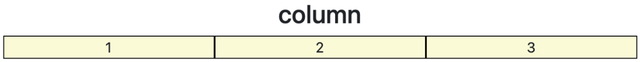

```html
<div class="container">
  <h2 class="text-center">column</h2>
  <div class="row">
    <div class="box col">1</div>
    <div class="box col">2</div>
    <div class="box col">3</div>
  </div>
</div>
```

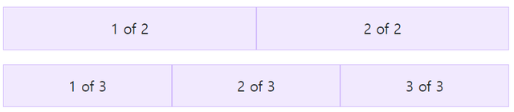

```html
<div class="container text-center">
  <div class="row">
    <div class="col">
      1 of 2
    </div>
    <div class="col">
      2 of 2
    </div>
  </div>
  <div class="row">
    <div class="col">
      1 of 3
    </div>
    <div class="col">
      2 of 3
    </div>
    <div class="col">
      3 of 3
    </div>
  </div>
</div>
```

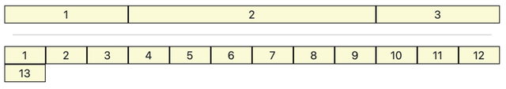

```html
<div class="container">
  <div class="row">
    <div class="box col-3">1</div>
    <div class="box col-6">2</div>
    <div class="box col-3">3</div>
  </div>
  <hr>
  <div class="row">
    <div class="box col-1">1</div>
    <div class="box col-1">2</div>
    <div class="box col-1">3</div>
    <div class="box col-1">4</div>
    <div class="box col-1">5</div>
    <div class="box col-1">6</div>
    <div class="box col-1">7</div>
    <div class="box col-1">8</div>
    <div class="box col-1">9</div>
    <div class="box col-1">10</div>
    <div class="box col-1">11</div>
    <div class="box col-1">12</div>
    <div class="box col-1">13</div>
  </div>
</div>
```


```html
<div class="container">
  <div class="row">
    <div class="box col-9">col-9</div>
    <div class="box col-4">col-4</div>
    <div class="box col-3">col-3</div>
  </div>
</div>
```

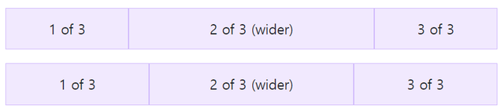

```html
<div class="container text-center">
  <div class="row">
    <div class="col">
      1 of 3
    </div>
    <div class="col-6">
      2 of 3 (wider)
    </div>
    <div class="col">
      3 of 3
    </div>
  </div>
  <div class="row">
    <div class="col">
      1 of 3
    </div>
    <div class="col-5">
      2 of 3 (wider)
    </div>
    <div class="col">
      3 of 3
    </div>
  </div>
</div>
```

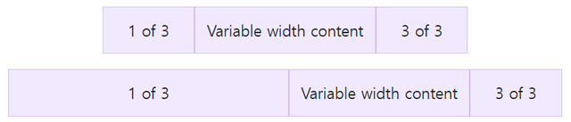

```html
<div class="container text-center">
  <div class="row justify-content-md-center">
    <div class="col col-lg-2">
      1 of 3
    </div>
    <div class="col-md-auto">
      Variable width content
    </div>
    <div class="col col-lg-2">
      3 of 3
    </div>
  </div>
  <div class="row">
    <div class="col">
      1 of 3
    </div>
    <div class="col-md-auto">
      Variable width content
    </div>
    <div class="col col-lg-2">
      3 of 3
    </div>
  </div>
</div>
```

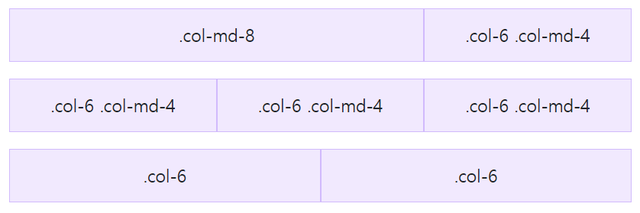

```html
<div class="container text-center">
  <!-- Stack the columns on mobile by making one full-width and the other half-width -->
  <div class="row">
    <div class="col-md-8">.col-md-8</div>
    <div class="col-6 col-md-4">.col-6 .col-md-4</div>
  </div>

  <!-- Columns start at 50% wide on mobile and bump up to 33.3% wide on desktop -->
  <div class="row">
    <div class="col-6 col-md-4">.col-6 .col-md-4</div>
    <div class="col-6 col-md-4">.col-6 .col-md-4</div>
    <div class="col-6 col-md-4">.col-6 .col-md-4</div>
  </div>

  <!-- Columns are always 50% wide, on mobile and desktop -->
  <div class="row">
    <div class="col-6">.col-6</div>
    <div class="col-6">.col-6</div>
  </div>
</div>
```

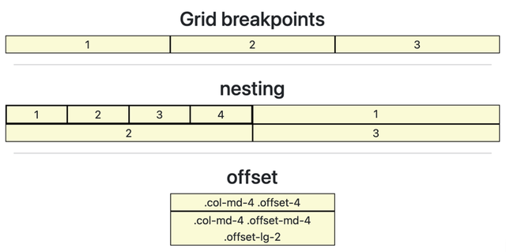

```html
<div class="container">
  <h2 class="text-center">Grid breakpoints</h2>
  <div class="row">
    <div class="box col-sm-8 col-md-4 col-lg-5">1</div>
    <div class="box col-8 col-sm-2 col-md-4 col-lg-2">2</div>
    <div class="box col-2 col-sm-2 col-md-4 col-lg-5">3</div>
  </div>
  <hr>
  <h2 class="text-center">nesting</h2>
  <div class="row">
    <div class="box col-6">
      <div class="row">
        <div class="box col-3">1</div>
        <div class="box col-3">2</div>
        <div class="box col-3">3</div>
        <div class="box col-3">4</div>
      </div>
    </div>
    <div class="box col-6">1</div>
    <div class="box col-6">2</div>
    <div class="box col-6">3</div>
  </div>
  <hr>
  <h2 class="text-center">offset</h2>
  <div class="row">
    <div class="box col-md-4 offset-4">.col-md-4 .offset-4</div>
    <div class="box col-md-4 offset-md-4 offset-lg-2">.col-md-4 .offset-md-4 .offset-lg-2</div>
  </div>
</div>
```

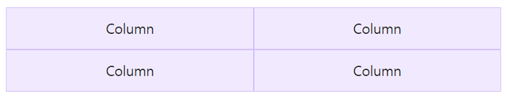

```html
<div class="container text-center">
  <div class="row row-cols-2">
    <div class="col">Column</div>
    <div class="col">Column</div>
    <div class="col">Column</div>
    <div class="col">Column</div>
  </div>
</div>
```

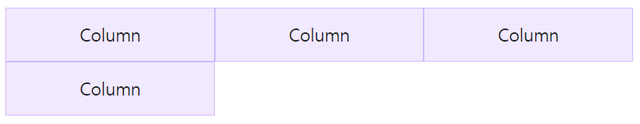

```html
<div class="container text-center">
  <div class="row row-cols-3">
    <div class="col">Column</div>
    <div class="col">Column</div>
    <div class="col">Column</div>
    <div class="col">Column</div>
  </div>
</div>
```

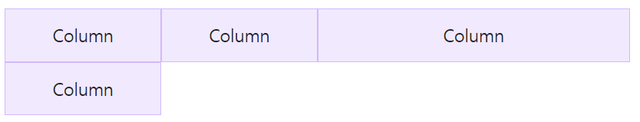

```html
<div class="container text-center">
  <div class="row row-cols-4">
    <div class="col">Column</div>
    <div class="col">Column</div>
    <div class="col-6">Column</div>
    <div class="col">Column</div>
  </div>
</div>
```

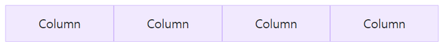

```html
<div class="container text-center">
  <!-- xs : 1x4, sm : 2x2, other : 4x1 -->
  <div class="row row-cols-1 row-cols-sm-2 row-cols-md-4">
    <div class="col">Column</div>
    <div class="col">Column</div>
    <div class="col">Column</div>
    <div class="col">Column</div>
  </div>
</div>
```

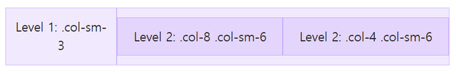

```html
<div class="container text-center">
  <div class="row">
    <div class="col-sm-3">
      Level 1: .col-sm-3
    </div>
    <div class="col-sm-9">
      <div class="row">
        <div class="col-8 col-sm-6">
          Level 2: .col-8 .col-sm-6
        </div>
        <div class="col-4 col-sm-6">
          Level 2: .col-4 .col-sm-6
        </div>
      </div>
    </div>
  </div>
</div>
```

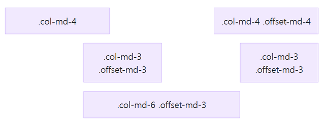

```html
<div class="container text-center">
  <div class="row">
    <div class="col-md-4">.col-md-4</div>
    <div class="col-md-4 offset-md-4">.col-md-4 .offset-md-4</div>
  </div>
  <div class="row">
    <div class="col-md-3 offset-md-3">.col-md-3 .offset-md-3</div>
    <div class="col-md-3 offset-md-3">.col-md-3 .offset-md-3</div>
  </div>
  <div class="row">
    <div class="col-md-6 offset-md-3">.col-md-6 .offset-md-3</div>
  </div>
</div>
```

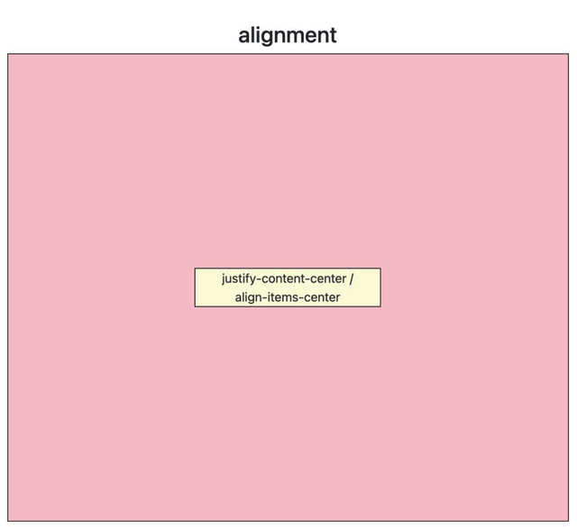

```html
<div class="container">
  <h2 class="text-center">alignment</h2>
  <div class="row parent justify-content-center align-items-center">
    <div class="box col-4">justify-content-center / align-items-center</div>
  </div>
</div>
```

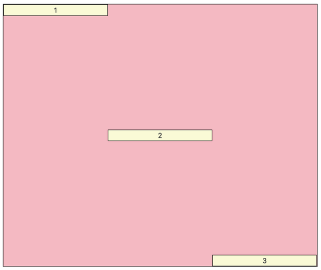

```html
<div class="container">
  <div class="row parent">
    <div class="box col-4 align-self-start">1</div>
    <div class="box col-4 align-self-center">2</div>
    <div class="box col-4 align-self-end">3</div>
  </div>
</div>
```

#### Gutter

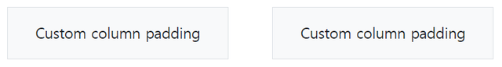

```html
<div class="container px-4 text-center">
  <div class="row gx-5">
    <div class="col">
     <div class="p-3 border bg-light">Custom column padding</div>
    </div>
    <div class="col">
      <div class="p-3 border bg-light">Custom column padding</div>
    </div>
  </div>
</div>
```

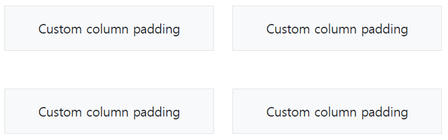

```html
<div class="container overflow-hidden text-center">
  <div class="row gy-5">
    <div class="col-6">
      <div class="p-3 border bg-light">Custom column padding</div>
    </div>
    <div class="col-6">
      <div class="p-3 border bg-light">Custom column padding</div>
    </div>
    <div class="col-6">
      <div class="p-3 border bg-light">Custom column padding</div>
    </div>
    <div class="col-6">
      <div class="p-3 border bg-light">Custom column padding</div>
    </div>
  </div>
</div>
```

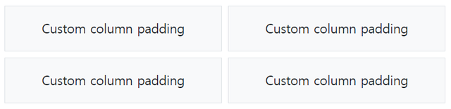

```html
<div class="container text-center">
  <div class="row g-2">
    <div class="col-6">
      <div class="p-3 border bg-light">Custom column padding</div>
    </div>
    <div class="col-6">
      <div class="p-3 border bg-light">Custom column padding</div>
    </div>
    <div class="col-6">
      <div class="p-3 border bg-light">Custom column padding</div>
    </div>
    <div class="col-6">
      <div class="p-3 border bg-light">Custom column padding</div>
    </div>
  </div>
</div>
```

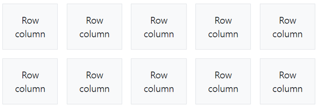

```html
<div class="container text-center">
  <div class="row row-cols-2 row-cols-lg-5 g-2 g-lg-3">
    <div class="col">
      <div class="p-3 border bg-light">Row column</div>
    </div>
    <div class="col">
      <div class="p-3 border bg-light">Row column</div>
    </div>
    <div class="col">
      <div class="p-3 border bg-light">Row column</div>
    </div>
    <div class="col">
      <div class="p-3 border bg-light">Row column</div>
    </div>
    <div class="col">
      <div class="p-3 border bg-light">Row column</div>
    </div>
    <div class="col">
      <div class="p-3 border bg-light">Row column</div>
    </div>
    <div class="col">
      <div class="p-3 border bg-light">Row column</div>
    </div>
    <div class="col">
      <div class="p-3 border bg-light">Row column</div>
    </div>
    <div class="col">
      <div class="p-3 border bg-light">Row column</div>
    </div>
    <div class="col">
      <div class="p-3 border bg-light">Row column</div>
    </div>
  </div>
</div>
```

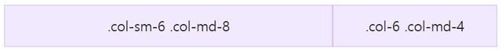

```html
<div class="row g-0 text-center">
  <div class="col-sm-6 col-md-8">.col-sm-6 .col-md-8</div>
  <div class="col-6 col-md-4">.col-6 .col-md-4</div>
</div>
```

## CSS Media Query

```css
@media (min-width: 576px) {
  .container-sm, .container {
    max-width: 540px;
  }
}
@media (min-width: 768px) {
  .container-md, .container-sm, .container {
    max-width: 720px;
  }
}
@media (min-width: 992px) {
  .container-lg, .container-md, .container-sm, .container {
    max-width: 960px;
  }
}
@media (min-width: 1200px) {
  .container-xl, .container-lg, .container-md, .container-sm, .container {
    max-width: 1140px;
  }
}
@media (min-width: 1400px) {
  .container-xxl, .container-xl, .container-lg, .container-md, .container-sm, .container {
    max-width: 1320px;
  }
}
```

- 지정한 규칙에 브라우저 및 장치 환경이 일치하는 경우에만 CSS를 적용
- 반응형 웹 디자인의 핵심 (필수는 아님)
  - viewport의 크기, 방향 및 기타 여러 상태에 따라 서로 다른 레이아웃을 생성할 수 있기 때문

### Media types

- `all` : 모두
- `print` : 인쇄된 본문
- `screen` : 화면에 표시된 본문
- `speech` : 음성

```css
@media print {
  body {
    font-size: 12pt;
  }
}
/* 페이지가 인쇄된 경우에만 폰트 크기를 12pt로 설정 */
```

```css
@media screen and (width: 600px) {
  body {
    color: red;
  }
}
/* viewport 너비가 정확히 600px인 경우 본문 색상을 빨간색으로 변경 */
```

```css
@media screen and (max-width: 400px) {
  body {
    color: blue;
  }
}
/* viewport 너비가 400px보다 좁은 경우 본문 색상을 파란색으로 변경 */
```

```css
@media screen and (min-width: 400px) and (orientation: landscape) {
  body {
    color: blue;
  }
}
/* viewport 너비가 400px 이상이고 장치가 가로 모드일 경우 본문 색상을 파란색으로 변경 */
```

```css
@media screen and (min-width: 400px), screen and (orientation: landscape) {
  body {
    color: blue;
  }
}
/* viewport 너비가 400px 이상이거나 장치가 가로 모드일 경우 본문 색상을 파란색으로 변경 */
```

```css
@media not all and (orientation: landscape) {
  body {
    color: blue;
  }
}
/* 장치가 세로 모드일 경우에만 본문 색상을 파란색으로 변경 */
```

